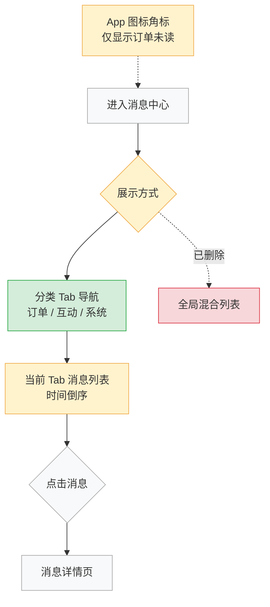

# 迭代模式示例：订单消息中心改版

本示例演示迭代模式（3步）的完整产出格式，供模型执行时参考。

**背景**：某电商 App 现有「消息中心」功能，将系统通知、订单状态变更、促销推送混合展示。用户反馈找不到订单相关消息，准备改版。

---

## Step 1 产出示例：变更摘要

### 现状理解
当前消息中心将所有消息类型混合在单一列表中，按时间倒序展示，无分类、无筛选、无角标区分，用户须手动滚动定位关键订单消息。

### 变更驱动（JTBD）
当我在等待重要订单状态更新时，我想要第一时间找到订单相关消息，以便及时跟进发货/退款进展；但现在促销推送和系统公告将订单消息淹没，导致我经常错过关键节点。

### 变更范围

| 类型 | 功能/模块 | 说明 |
|:---|:---|:---|
| 🆕 新增 | 消息分类 Tab | 「订单」「互动」「系统」三类 Tab，默认展示订单 Tab |
| 🆕 新增 | 未读角标分类显示 | 每类 Tab 独立显示未读数，不合并 |
| ✏️ 修改 | 消息列表排序逻辑 | 每类 Tab 内部按时间倒序，各 Tab 独立分页 |
| ✏️ 修改 | 消息推送入口 | 点击推送通知直接跳转对应分类 Tab |
| 🗑️ 删除 | 全局未读总数角标 | 拆分为分类角标后，App 图标角标改为仅显示订单未读数 |
| ✅ 保留不变 | 消息已读/全部已读逻辑 | Tab 内单独全部已读，行为不变 |
| ✅ 保留不变 | 消息详情页 | 点击消息进入详情，交互不变 |

### 关键假设与待确认项
- 假设1：三类 Tab 分类方式已对齐产品/运营（订单 = 物流+退款，互动 = 评价+关注，系统 = 活动+账户）
- 假设2：App 图标角标改为仅显示订单未读数，已与业务方确认不影响促销触达目标

---

## Step 2 产出示例：Diff 流程图 + 影响面分析

### Diff 流程图（颜色约定：新增绿 / 修改黄 / 删除红 / 不变灰）



### 关联影响说明

| 受影响模块 | 影响描述 | 是否需要同步修改 |
|:---|:---|:---|
| 推送通知 deeplink | 点击通知须携带分类参数，跳转至对应 Tab | ✅ 需修改 |
| App 首页角标徽章 | 改为只统计订单未读数 | ✅ 需修改 |
| 消息全部已读接口 | 须支持按 Tab 分类的全部已读操作 | ✅ 需修改 |
| 用户偏好设置 | 各类消息的通知开关需细分到分类维度 | ⚠️ 建议跟进（当前版本可暂不修改） |

### 需同步更新的异常场景
- 「未读消息数统计」的 P0 异常：三类 Tab 未读数独立计算，需防止跨类型重复计数
- 「消息分类失败」新增异常：若消息类型字段缺失，默认归入「系统」Tab，不丢失消息

---

## Step 3 产出示例：变更功能规格

### 🆕 新增：消息分类 Tab

- **JTBD**：当我进入消息中心时，我想要直接看到订单相关消息，以便不被无关通知干扰
- **RICE 分**：Reach 8000 × Impact 2 × Confidence 80% ÷ Effort 1.5 = **8533**
- **验收标准（BDD）**：

  ```
  场景一：正常进入消息中心
    Given 用户已登录，存在各类消息
    When  用户点击底部导航「消息」
    Then  默认展示「订单」Tab，显示订单相关消息列表
          Tab 栏显示「订单」「互动」「系统」三个 Tab
          每个 Tab 右上角显示各自未读消息数（0 时不显示角标）

  场景二：某类 Tab 无消息
    Given 用户「互动」类消息为空
    When  用户切换至「互动」Tab
    Then  展示空状态页（「暂无互动消息」+引导文案）
          不显示角标，不报错
  ```

### ✏️ 修改：App 图标角标统计逻辑

- **变更说明**：原来合并所有未读消息总数，改为仅统计「订单」类未读数
- **RICE 分**：Reach 12000 × Impact 1 × Confidence 90% ÷ Effort 0.5 = **21600**
- **验收标准（BDD）**：

  ```
  场景一：有未读订单消息
    Given 用户有 3 条未读订单消息、5 条未读促销消息
    When  用户返回手机桌面
    Then  App 图标角标显示「3」（仅订单未读数）

  场景二：订单消息全部已读
    Given 用户将所有订单消息标记已读
    When  无论是否有其他类型未读消息
    Then  App 图标角标消失（不显示角标）
  ```

### 🗑️ 删除：全局未读总数角标（消息中心入口）

- **下线原因**：分类角标已承载角标信息，全局合并数字对用户决策无指导意义
- **影响用户**：所有使用消息中心的登录用户
- **迁移/降级方案**：无需数据迁移；若需灰度，可保留 7 天后全量下线

### 分期建议（MVP 优先）

| 阶段 | 包含变更 | 目标 |
|:---|:---|:---|
| MVP（第一期） | 消息分类 Tab + App 角标修改 + 全局角标下线 | 解决核心体验问题，1 个迭代上线 |
| 第二期 | 推送 deeplink 携带分类参数 + 消息偏好设置细分 | 完善分类体系，可延后 1 个迭代 |
