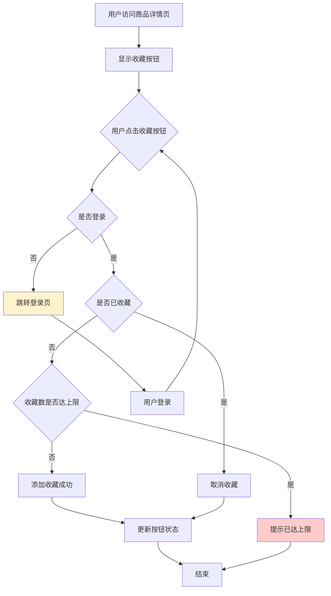
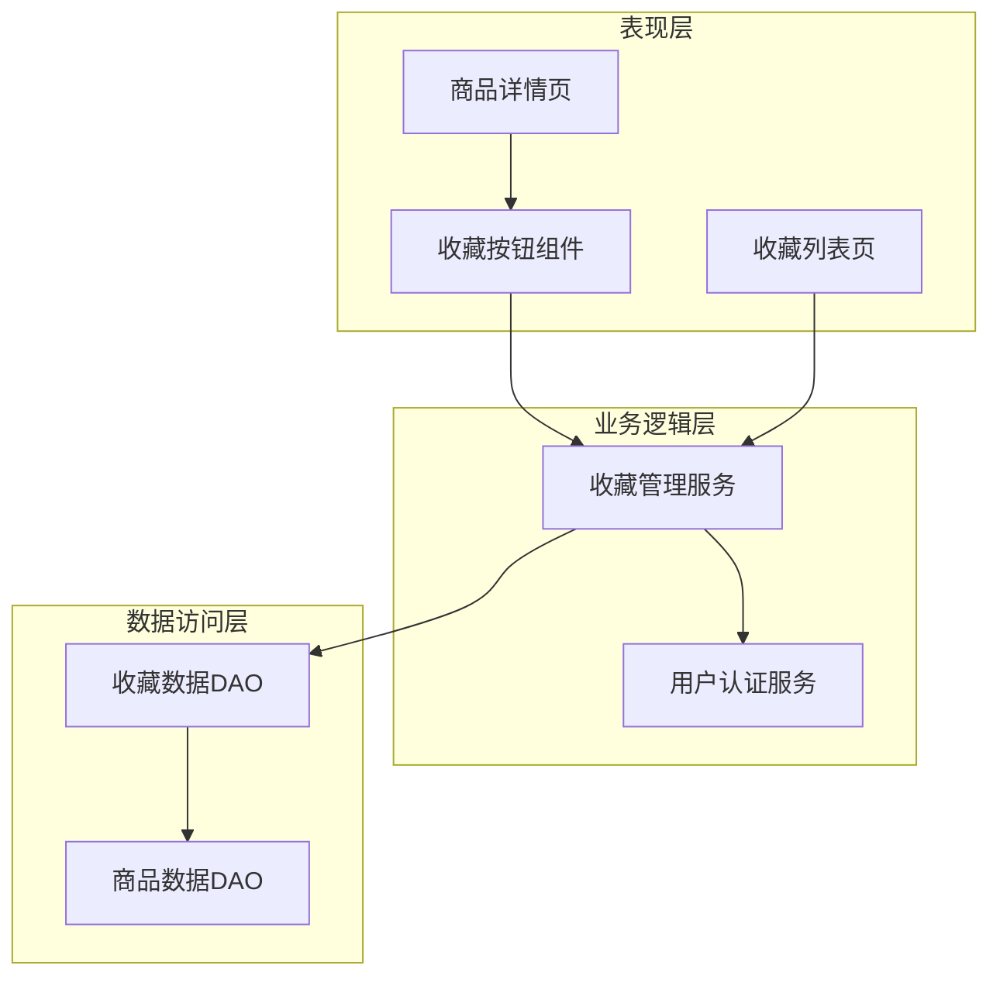

# 示例：简单功能分析 - 商品收藏功能

本示例展示如何使用**快速模式**分析一个简单功能。

---

## 📊 需求复杂度评估

| 评估维度 | 评分 | 说明 |
|---------|------|------|
| 功能点数量 | 3分 | 1个核心功能（收藏按钮） |
| 用户角色数 | 2分 | 1个角色（登录用户） |
| 系统集成 | 0分 | 无外部集成 |
| 业务规则复杂度 | 3分 | 简单（仅判断登录状态和收藏状态） |
| 数据复杂度 | 3分 | 简单（单表关联） |
| **总分** | **11分** | **低复杂度** |

**推荐模式**：快速模式（3步）  
**推荐框架**：用户故事

---

## 步骤1：需求概述与理解

### 需求背景
用户在浏览商品时，希望能够快速收藏感兴趣的商品，以便后续快速访问。

### 业务目标
- 提升用户留存率
- 增加用户revisit频率
- 收集用户兴趣数据

### 目标用户
- 已登录的普通用户

### 核心功能清单
1. **收藏按钮显示**：在商品详情页显示收藏按钮
2. **添加收藏**：点击未收藏商品的按钮，添加到收藏列表
3. **取消收藏**：点击已收藏商品的按钮，从列表中移除

### 用户故事
```
作为一个登录用户，
我想要在商品详情页快速收藏商品，
以便后续快速找到感兴趣的商品，避免搜索的麻烦。

验收标准：
- 点击收藏按钮后，按钮状态立即改变
- 收藏成功后，在"我的收藏"列表中能看到该商品
- 再次点击可以取消收藏
- 未登录用户点击时，跳转到登录页
```

### 关键假设
1. 用户必须登录才能使用收藏功能
2. 每个用户的收藏列表上限为100个商品
3. 商品下架后，收藏关系仍然保留

### 待澄清问题
1. 是否需要收藏分类（如"想买"、"比价中"）？
2. 是否需要收藏商品的价格变动提醒？

---

## 步骤2：核心业务流程

### 高层级流程图



### 流程步骤说明

1. **用户访问商品详情页**
   - 页面加载时，根据用户登录状态和收藏状态显示按钮样式
   - 未登录：显示普通收藏按钮
   - 已登录+未收藏：显示"收藏"按钮
   - 已登录+已收藏：显示"已收藏"按钮

2. **用户点击收藏按钮**
   - 触发收藏/取消收藏操作

3. **登录状态检查**
   - 未登录：引导到登录页，登录成功后返回继续操作
   - 已登录：继续下一步

4. **收藏状态检查**
   - 已收藏：执行取消收藏
   - 未收藏：执行添加收藏

5. **收藏数量检查**（仅添加收藏时）
   - 达到上限100个：提示用户清理收藏列表
   - 未达上限：添加成功

6. **更新按钮状态**
   - 实时更新按钮文案和样式
   - 提示用户操作结果

### 关键异常清单

| 异常场景 | 优先级 | 触发条件 | 处理策略 |
|---------|--------|---------|---------|
| 用户未登录 | P0 | 点击收藏时未登录 | 跳转登录页，登录后自动完成收藏 |
| 收藏数达上限 | P1 | 收藏列表已有100个商品 | 提示"收藏已达上限，请先清理收藏列表" |
| 网络异常 | P1 | 收藏接口请求失败 | 提示"网络异常，请稍后重试"，按钮状态不变 |
| 重复收藏 | P1 | 并发点击或网络延迟 | 接口幂等性设计，提示"已收藏" |
| 商品已下架 | P1 | 商品状态变更 | 允许收藏但标注"商品已下架" |
| 接口超时 | P2 | 收藏接口响应超过5秒 | 提示"操作超时"，建议刷新页面 |

---

## 步骤3：简要功能架构

### 功能架构图



### 功能模块划分

#### 1. UI展示模块（表现层）
**职责**：
- 商品详情页展示收藏按钮
- 收藏列表页展示已收藏商品
- 用户交互和状态展示

**功能点**：
- 收藏按钮组件（显示、点击、状态切换）
- 收藏列表展示
- 加载状态和错误提示

#### 2. 收藏管理模块（业务逻辑层）
**职责**：
- 收藏业务逻辑处理
- 权限校验
- 数据校验

**功能点**：
- 添加收藏
- 取消收藏
- 查询收藏状态
- 获取收藏列表
- 收藏数量统计

#### 3. 数据存储模块（数据访问层）
**职责**：
- 收藏关系持久化
- 数据查询

**功能点**：
- 收藏关系CRUD
- 收藏数量查询
- 收藏商品信息关联

### 功能优先级

**P0（MVP必需）**：
- 收藏按钮显示
- 添加收藏功能
- 取消收藏功能
- 登录状态校验

**P1（第一期上线）**：
- 收藏列表页面
- 收藏数量限制
- 基础异常处理

**P2（后续优化）**：
- 收藏数量统计
- 收藏分类
- 批量管理

### 迭代规划

**第一期（2周）**：
- 目标：核心收藏功能上线
- 范围：P0功能 + 基础异常处理
- 输出：可用的收藏功能

**第二期（1周）**：
- 目标：完善用户体验
- 范围：P1功能 + 优化异常提示
- 输出：完整的收藏体验

---

## 📦 交付物总结

### 已生成文档
- ✅ 需求理解总结
- ✅ 高层级业务流程图
- ✅ 异常场景清单（6个）
- ✅ 功能架构图
- ✅ 功能优先级矩阵
- ✅ 迭代规划

### 关键产出
1. **流程清晰**：从用户点击到状态更新的完整链路
2. **异常全面**：识别6个关键异常场景
3. **架构合理**：分层清晰，职责明确
4. **计划可行**：2个迭代，3周完成

### 可直接使用
- 流程图可作为技术方案设计参考
- 异常清单可作为测试用例基础
- 功能架构可指导代码模块划分
- 迭代规划可作为排期依据

---

## 💡 本案例的关键要点

### 1. 需求简单不代表分析简单
虽然只是一个收藏按钮，但仍需考虑：
- 登录状态
- 收藏状态
- 数量限制
- 异常处理

### 2. 快速模式的价值
- 20分钟完成核心分析
- 聚焦关键路径
- 识别核心异常
- 提供可执行方案

### 3. MECE原则的应用
功能划分清晰：
- UI层 - 只管展示和交互
- 业务层 - 只管业务逻辑
- 数据层 - 只管数据存储
- 无重叠、无遗漏

### 4. 用户故事的作用
通过用户故事明确：
- 用户是谁
- 想要什么
- 为什么需要
- 如何验收

---

## 🔄 如果使用标准模式

如果这个需求使用标准模式，会增加：

1. **详细流程图**
   - 包含API调用细节
   - 数据库操作步骤
   - 错误处理分支

2. **更全面的异常识别**
   - 至少15个异常场景
   - 包含技术层面异常（数据库、缓存、消息队列等）

3. **详细的功能规格**
   - 每个功能的输入输出规格
   - 前置条件和后置条件
   - API接口定义

4. **可能的外部调研**
   - 竞品的收藏功能对比
   - 行业最佳实践

**预计耗时**：60-80分钟

**建议**：对于这种简单功能，快速模式更高效，标准模式会过度设计。
