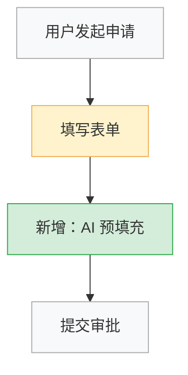

# 迭代模式工作流 v6.5

适用于**存量功能改版/迭代**场景：在已有功能或 PRD 基础上进行需求变更、体验优化、功能扩展。

> **与新建模式的核心区别**：不做全量梳理，聚焦 **Diff**——明确「什么变了、影响哪里、优先做什么」。

---

## 执行前一次性准备

**首次进入本文件时读取（仅一次）**：
- `guides/confirmation-templates.md` — 确认话术模板
- `guides/quality-checklist.md` — 质量检查清单

---

## 迭代模式触发条件

用户描述中出现以下任一特征时，Phase 2 推荐迭代模式：

- 明确提到已有产品/功能（"现有的 XX 功能需要改"）
- 上传了现有 PRD、设计稿、功能描述文档
- 需求以「变更」语言描述（"把 XX 改成 YY"、"增加 XX 能力"、"去掉 XX"）
- 目标是局部优化而非从零构建

---

## Step 1：解析变更需求

📚 **本步参考**：`references/analysis-frameworks.md`（重点：JTBD、用户故事）

**核心任务**：

1. **理解现状**：提取现有功能的核心逻辑（从用户描述、上传文档或已知知识中获取）
2. **定义变更范围**：用结构化方式明确「增 / 改 / 删 / 不变」四类功能
3. **挖掘变更动机**：用 JTBD 分析「为什么要改」，而不只是「改什么」
4. **标注关键假设**：对现状理解不确定的地方明确标注，等待用户确认

**交付产物**——变更摘要（用以下结构输出）：

```
## 变更摘要

### 现状理解
[现有功能的核心逻辑，1–3 句话]

### 变更驱动（JTBD）
当 [情境] 时，用户想要 [动机]，但现在 [痛点]，所以需要 [变更方向]。

### 变更范围
| 类型 | 功能/模块 | 说明 |
|:---|:---|:---|
| 🆕 新增 | | |
| ✏️ 修改 | | |
| 🗑️ 删除 | | |
| ✅ 保留不变 | | |

### 关键假设与待确认项
- 假设1：[对现状的假设，需要用户确认]
- 假设2：
```

**质量检查**：
- [ ] 已明确区分「变更」和「保留」部分
- [ ] 已识别变更背后的业务动机（JTBD）
- [ ] 不确定的现状假设已标注

**用户确认（MUST）**：使用 `guides/confirmation-templates.md` 中「【迭代模式】Step 1 确认」模板，填入实际产出，展示并等待用户回复。

---

## Step 2：影响面分析

📚 **本步参考**：`references/flowchart-standards.md` + `references/exception-checklist.md`

**核心任务**：

1. **绘制 Diff 流程图**：仅展示受影响的流程节点，用颜色/标记区分新增/修改/删除
2. **识别关联影响**：「改 A」是否会波及 B、C 模块（数据流、状态机、下游依赖）
3. **异常影响评估**：已有异常处理是否需要同步更新

**Mermaid Diff 标注约定**：
```
%% 颜色约定：style 节点 fill:#颜色
%% 🆕 新增节点：fill:#d4edda（绿色）
%% ✏️ 修改节点：fill:#fff3cd（黄色）
%% 🗑️ 删除节点：fill:#f8d7da（红色）
%% ✅ 不变节点：fill:#f8f9fa（灰色）
```

示例：


**交付产物**：Diff 流程图（Mermaid）、关联影响说明、需要同步更新的异常场景清单

**质量检查**：
- [ ] Diff 流程图清晰标注了变更类型
- [ ] 已梳理关联模块的影响面
- [ ] 已评估是否需要更新已有异常处理逻辑
- [ ] 自动化检查：
  ```bash
  SKILL_BASE=$(cat /tmp/pa_skill_base.txt 2>/dev/null || echo "")
  cat << 'MERMAID_EOF' > /tmp/qa_check_temp.md
  <Diff流程图内容>
  MERMAID_EOF
  if [ -n "$SKILL_BASE" ]; then
    python3 "$SKILL_BASE/scripts/validate_mermaid.py" /tmp/qa_check_temp.md
  else
    echo "SKIP: 脚本目录未找到，人工核查 Mermaid 语法"
  fi
  rm /tmp/qa_check_temp.md
  ```

**用户确认（MUST）**：使用 `guides/confirmation-templates.md` 中「【迭代模式】Step 2 确认」模板，展示并等待用户回复。

---

## Step 3：变更功能规格 + 优先级评估

📚 **本步参考**：`references/architecture-patterns.md` + `references/analysis-frameworks.md`（RICE、KANO）

**核心任务**：

1. **仅描述变更部分的功能规格**：新增和修改的功能用 BDD 写验收标准，删除的功能写下线影响说明
2. **RICE 评分**：对变更项进行优先级量化，尤其当有多个并行改动时
3. **保留不变部分**：只需列出清单，不重复描述规格
4. **MVP 建议**：若变更量大，给出分期建议（哪些变更先上，哪些可延后）

**功能规格输出格式**：

```markdown
### 变更功能规格

#### 🆕 新增：[功能名称]
- **JTBD**：当 [情境] 时，我想 [动机]，以便 [价值]
- **RICE 分**：Reach___ × Impact___ × Confidence___% ÷ Effort___ = ___
- **验收标准（BDD）**：
  ```
  场景一：[正常路径]
    Given [前置状态]
    When  [用户操作]
    Then  [系统响应]
  场景二：[异常路径]
    Given [前置状态]
    When  [触发条件]
    Then  [系统响应]
  ```

#### ✏️ 修改：[功能名称]
- **变更说明**：[原来是 XX，改为 YY，原因是 ZZ]
- **RICE 分**：___
- **验收标准（BDD）**：（仅描述变更后的预期行为）
  ```
  场景一：...
  ```

#### 🗑️ 删除：[功能名称]
- **下线原因**：
- **影响用户**：[受影响的用户群体和场景]
- **迁移/降级方案**：[用户原有数据如何处理，无则填"无"]
```

**质量检查**：
- [ ] 新增和修改功能均有 BDD 验收标准
- [ ] P0/P1 变更有 RICE 评分
- [ ] 删除功能有影响说明和迁移方案（若适用）
- [ ] 自动化检查：
  ```bash
  SKILL_BASE=$(cat /tmp/pa_skill_base.txt 2>/dev/null || echo "")
  if [ -n "$SKILL_BASE" ]; then
    cat << 'MERMAID_EOF' > /tmp/qa_check_temp.md
  <变更规格内容>
  MERMAID_EOF
    python3 "$SKILL_BASE/scripts/check_mece.py" /tmp/qa_check_temp.md
    rm /tmp/qa_check_temp.md
  else
    echo "SKIP: 脚本目录未找到，人工核查 MECE 原则"
  fi
  ```

**用户确认（MUST）**：使用 `guides/confirmation-templates.md` 中「【迭代模式】Step 3 确认」模板，展示并等待用户回复。

---

## 轻量版调研（按需）

**触发条件**：变更涉及竞品已有、但本产品缺失的能力，用户要求参考竞品做法。

**执行规则**：
1. 与用户确认调研范围（1–2 个竞品或关键词）
2. `web_search` 检索 1–2 个信源
3. 输出：简要竞品功能对比（仅针对变更相关维度），不超过半页
4. 明确说明调研结论如何影响当前变更设计

---

## 最终交付

### 询问输出格式

> \"📄 **迭代模式输出文档**（可多选）：
>
> 1. **变更分析报告** — Diff 流程图 + 影响面说明 + 变更功能规格
> 2. **更新版功能架构设计** — 仅含变更模块的架构描述（适合提供给开发团队）
> 3. **变更版 PRD** — 在现有 PRD 结构上标注变更内容（适合正式评审）
> 4. **开发任务拆解清单** — 按 Epic → Story → Task 三层，含 BDD 验收标准，可导入 Jira/Linear
> 5. **Draw.io Diff 图表** — 将 Diff 流程图导出为可编辑的 .drawio 文件
>
> 推荐组合：快速对齐选 1，给开发团队选 1+4，正式评审选 3+4。\"

### 生成文档

| 选项 | 模板 | 输出文件名 |
|:---|:---|:---|
| 1. 变更分析报告 | `assets/business-flow.tpl.md`（适配变更内容） | `[名称]-变更分析-YYYYMMDD.md` |
| 2. 更新版功能架构设计 | `assets/feature-architecture.tpl.md` | `[名称]-功能架构设计-迭代版-YYYYMMDD.md` |
| 3. 变更版 PRD | `assets/prd.tpl.md` | `[名称]-PRD-迭代版-YYYYMMDD.md` |
| 4. 开发任务拆解清单 | `assets/tickets.tpl.md` | `[名称]-Tickets-YYYYMMDD.md` |
| 5. Draw.io Diff 图表 | 参见主 workflow 的「Draw.io 图表输出」章节 | `[名称]-Diff图表-YYYYMMDD.drawio` |

文件保存至 Phase 3 创建的专属目录（路径从 `/tmp/pa_output_dir.txt` 读取）：
```bash
OUTPUT_DIR=$(cat /tmp/pa_output_dir.txt)
# 示例：cp [名称]-变更分析-YYYYMMDD.md "$OUTPUT_DIR/"
```

**最终质量保证**：
- [ ] Diff 流程图清晰标注了变更类型和颜色
- [ ] 所有新增/修改功能均有 BDD 验收标准
- [ ] P0/P1 变更有 RICE 评分
- [ ] 文件命名包含 `-迭代版-YYYYMMDD` 后缀，已保存至输出目录
- [ ] 等待用户明确回复

---

## Draw.io 图表输出（可选）

**触发时机**：用户在最终交付的格式选择中选择了第 5 项（Draw.io Diff 图表）。

📚 **读取**：`references/drawio-standards.md`

1. 识别本次生成的 Diff 流程图（Step 2 产出）
2. 按 `references/drawio-standards.md` 规范转换为 Draw.io XML，**须保留颜色标注**（新增绿 `#d4edda` / 修改黄 `#fff3cd` / 删除红 `#f8d7da` / 不变灰 `#f8f9fa`）
3. 输出 `.drawio` 文件，优先调用 MCP 工具；MCP 不可用时使用兜底方式直接写入：
   ```bash
   OUTPUT_DIR=$(cat /tmp/pa_output_dir.txt)
   FILENAME="[名称]-Diff图表-$(date +%Y%m%d).drawio"
   cat << 'DRAWIO_EOF' > "$OUTPUT_DIR/$FILENAME"
   <mxfile><diagram name="Diff-Flow"><mxGraphModel>
   <!-- 将含颜色标注的 Draw.io XML 内容粘贴至此处 -->
   </mxGraphModel></diagram></mxfile>
   DRAWIO_EOF
   echo "文件已写入：$OUTPUT_DIR/$FILENAME（MCP 不可用，已直接写入文件）"
   ```
4. 展示已输出的文件清单，流程结束

**质量检查**：
- [ ] Diff 流程图颜色标注已保留（新增绿/修改黄/删除红/不变灰）
- [ ] 节点名称、连线方向与原 Mermaid Diff 图一致
- [ ] 文件已保存至输出目录并展示给用户
