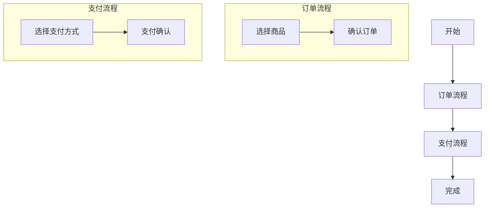
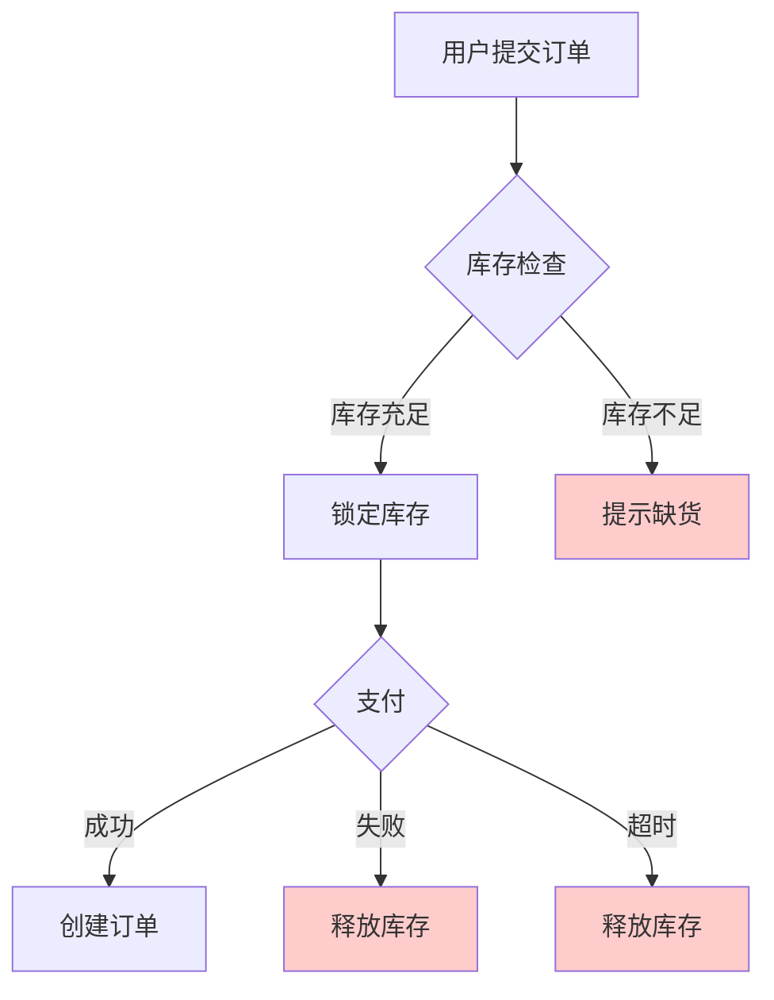
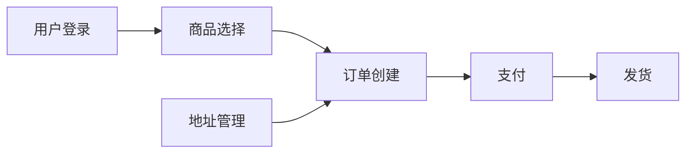

# 故障排除指南

解决产品需求分析过程中的常见问题。

---

## 🔧 常见问题分类

### 1. 需求理解问题
### 2. 流程图生成问题
### 3. 异常识别问题
### 4. 功能架构问题
### 5. 文档生成问题
### 6. 用户沟通问题

---

## 1️⃣ 需求理解问题

### 问题：需求描述模糊不清

**症状**：
- 用户提供的需求过于简单
- 缺少关键信息
- 目标不明确

**解决方案**：
```markdown
**步骤1**：使用5W1H方法提问
- What: 具体要做什么功能？
- Why: 为什么需要这个功能？
- Who: 目标用户是谁？
- When: 什么时候需要上线？
- Where: 在哪个场景下使用？
- How: 期望如何实现？

**步骤2**：如果用户无法回答，基于训练知识提供行业通用做法假设，并明确标注「基于已知知识，非实时调研」

**步骤3**：记录假设
"基于行业通用做法，我假设..."
```

**示例**：
```
用户：帮我分析一个积分系统

Agent回应：
为了更好地分析积分系统需求，我需要了解：
1. 积分用途：兑换商品？抵扣现金？会员升级？
2. 获取方式：消费获得？任务获得？签到获得？
3. 目标用户：C端用户？B端商家？
4. 业务场景：电商？社交？内容平台？

如果暂时无法确定，我可以参考行业最佳实践给出建议。
```

---

### 问题：功能点识别不全

**症状**：
- 只看到明显的功能
- 遗漏隐含需求
- 忽略边界情况

**解决方案**：
```markdown
**使用MECE原则系统化梳理**：

1. **按用户旅程拆解**
   - 用户进入
   - 用户使用
   - 用户离开

2. **按功能层级拆解**
   - 核心功能
   - 辅助功能
   - 管理功能

3. **按角色拆解**
   - 每个角色需要什么功能
   - 角色之间如何协作
```

**检查清单**：
- [ ] 是否考虑了所有用户角色的需求？
- [ ] 是否包含了管理后台功能？
- [ ] 是否考虑了数据导入导出？
- [ ] 是否考虑了权限管理？
- [ ] 是否考虑了审计和日志？

---

## 2️⃣ 流程图生成问题

### 问题：Mermaid语法错误

**症状**：
- 流程图无法渲染
- 语法报错

**常见错误和修正**：

**错误1：节点ID包含空格或特殊字符**
```mermaid
❌ 错误：
graph TD
    用户登录 --> 验证通过

✅ 正确：
graph TD
    A[用户登录] --> B[验证通过]
```

**错误2：箭头语法错误**
```mermaid
❌ 错误：
graph TD
    A -> B  （单箭头）

✅ 正确：
graph TD
    A --> B  （双箭头）
```

**错误3：决策节点形状错误**
```mermaid
❌ 错误：
graph TD
    A[是否登录]  （方框）

✅ 正确：
graph TD
    A{是否登录}  （菱形）
```

**验证方法**：
```markdown
生成流程图后，可以在以下网站验证：
1. https://mermaid.live/
2. 复制Mermaid代码
3. 查看是否正确渲染
4. 修正错误后再展示给用户
```

---

### 问题：流程图过于复杂难以理解

**症状**：
- 节点过多（超过15个）
- 箭头交叉混乱
- 层级不清晰

**解决方案**：

**方案1：分层展示**
```markdown
不要把所有细节放在一张图里，而是：
1. 高层级图：只显示核心流程（5-8个节点）
2. 详细图：针对复杂节点展开详细流程
```

**方案2：使用子图（subgraph）**


**方案3：简化决策逻辑**
```markdown
❌ 不要在一个决策点有5个以上分支
✅ 将复杂决策拆分成多个简单决策
```

---

### 问题：流程图缺少关键信息

**症状**：
- 没有标注决策条件
- 没有标注异常路径
- 没有标注时间节点

**补充规范**：


**标注要点**：
- 决策节点的每个分支都要标注条件
- 使用颜色区分正常/异常路径
- 重要时间节点要标注（如"30分钟未支付"）

---

## 3️⃣ 异常识别问题

### 问题：异常场景识别不全

**症状**：
- 只识别了5个以下异常
- 只考虑了明显的错误情况
- 忽略了边界场景

**系统化识别方法**：

**步骤1：使用异常清单逐项检查**
```bash
# 必须执行
python3 scripts/validate_mermaid.py 或直接读取 references/exception-checklist.md

# 对照清单逐项检查
1. 业务异常 - 数据异常
2. 业务异常 - 业务规则异常
3. 业务异常 - 流程异常
4. 场景异常 - ...
...
```

**步骤2：针对每个流程节点提问**
```markdown
对于流程中的每个节点，问：
1. 如果数据缺失会怎样？
2. 如果数据格式错误会怎样？
3. 如果权限不足会怎样？
4. 如果网络中断会怎样？
5. 如果服务不可用会怎样？
6. 如果用户重复操作会怎样？
```

**步骤3：考虑特殊用户和场景**
```markdown
- 新用户首次使用
- VIP用户
- 黑名单用户
- 并发访问
- 高峰期
- 维护期
```

**目标数量**：
- 快速模式：至少 2–3 个关键异常（P0/P1 级别）
- 标准模式：至少 10–15 个有意义的异常场景（四类均覆盖）

---

### 问题：异常优先级评估不准

**症状**：
- 所有异常都标记为P0
- 或所有异常都标记为P2
- 优先级缺乏依据

**评估标准**：

**P0（紧急且严重）**：
- 导致核心流程完全无法进行
- 造成资金损失或安全问题
- 影响大量用户

示例：支付失败、数据丢失、严重超卖

**P1（重要）**：
- 影响用户体验但有备选方案
- 影响部分功能但不影响核心流程
- 频繁发生

示例：优惠券计算错误、页面加载慢、提示信息不友好

**P2（次要）**：
- 不影响核心功能
- 发生概率低
- 有变通方法

示例：统计数据偏差、非核心功能小bug

**P3（可选）**：
- 边缘场景
- 极少发生
- 影响很小

示例：特殊浏览器兼容、罕见数据格式

---

## 4️⃣ 功能架构问题

### 问题：功能划分违反MECE原则

**症状**：
- 模块之间有重叠
- 某些功能不知道归属哪个模块
- 模块职责不清

**检查方法**：

**检查重叠（Mutually Exclusive）**：
```markdown
**反例**：
- 订单模块：包含订单创建、支付
- 支付模块：包含支付、退款

问题：支付功能有重叠

**正确划分**：
- 订单模块：订单创建、订单管理、订单查询
- 支付模块：支付发起、支付回调、退款处理
```

**检查遗漏（Collectively Exhaustive）**：
```markdown
画一个表格，列出所有功能：

| 功能 | 归属模块 | 检查 |
|-----|---------|------|
| 订单创建 | 订单模块 | ✓ |
| 支付 | 支付模块 | ✓ |
| 库存锁定 | ??? | ✗ 遗漏 |

发现遗漏后，补充"库存模块"
```

**修正步骤**：
1. 列出所有功能（无遗漏）
2. 按职责分组（无重叠）
3. 验证每个功能只归属一个模块
4. 验证所有功能都有归属

---

### 问题：功能依赖关系不清

**症状**：
- 不知道哪个功能依赖哪个功能
- 迭代顺序不合理
- 开发时发现前置功能未完成

**解决方案**：

**步骤1：列出所有功能的前置条件**
```markdown
| 功能 | 前置条件（依赖的功能） |
|-----|---------------------|
| 订单创建 | 用户登录、商品选择、地址管理 |
| 支付 | 订单创建 |
| 发货 | 支付成功 |
```

**步骤2：绘制依赖关系图**


**步骤3：识别循环依赖并打破**
```markdown
❌ 发现循环依赖：
A依赖B，B依赖C，C依赖A

✅ 打破循环：
重新设计，确保依赖关系是单向的
```

---

## 5️⃣ 文档生成问题

### 问题：文档结构混乱

**症状**：
- 没有清晰的章节
- 内容跳跃
- 缺少目录

**解决方案**：

**使用标准模板**：
```bash
# 使用 view 工具读取 assets/ 下对应模板，填入实际分析内容后写入以下位置：
# $OUTPUT_DIR/[产品名称]-[文档类型]-[模式版].md
```

**标准文档结构**：
```markdown
# 文档标题

## 1. 概述
- 业务背景
- 目标
- 范围

## 2. 用户和角色
- 角色定义
- 权限矩阵

## 3. 业务流程
- 高层级流程图
- 详细流程图
- 流程说明

## 4. 功能架构
- 架构图
- 模块划分
- 功能清单

## 5. 异常处理
- 异常清单
- 处理策略

## 6. 附录
- 术语表
- 参考资料
```

---

### 问题：Markdown格式错误

**常见错误**：

**错误1：标题层级混乱**
```markdown
❌ 错误：
# 标题1
### 标题3  （跳过了##）
## 标题2

✅ 正确：
# 标题1
## 标题2
### 标题3
```

**错误2：代码块未闭合**
```markdown
❌ 错误：
```mermaid
graph TD
    A --> B
（没有结束的```）

✅ 正确：
```mermaid
graph TD
    A --> B
```
```

**错误3：表格格式错误**
```markdown
❌ 错误：
| 列1 | 列2
| 值1 | 值2  （缺少分隔行）

✅ 正确：
| 列1 | 列2 |
|-----|-----|
| 值1 | 值2 |
```

---

## 6️⃣ 用户沟通问题

### 问题：用户反馈不明确

**症状**：
- 用户只说"不对"但不说哪里不对
- 用户说"再想想"
- 用户不回复

**应对策略**：

**策略1：主动引导**
```markdown
不要只问"是否确认？"，而要：

"请您重点确认以下几点：
1. 流程图中的[具体节点]是否准确？
2. 是否遗漏了[可能的场景]？
3. [某个功能]的优先级是否合理？

如果以上都准确，请回复'确认'；
如果需要调整，请告诉我具体是第几点需要修改。"
```

**策略2：提供选项**
```markdown
"关于支付失败的处理，有两种方案：
方案A：立即释放库存，用户需要重新下单
方案B：保留30分钟，用户可以重新支付

您倾向于哪个方案？或者有其他想法？"
```

**策略3：举例说明**
```markdown
"如果不确定，我给您举个例子：
类似功能在淘宝的做法是...[具体描述]
在京东的做法是...[具体描述]

这样的做法您觉得如何？"
```

---

### 问题：用户提出大量修改

**症状**：
- 确认后又要求大改
- 不断推翻之前的方案
- 需求频繁变化

**应对策略**：

**策略1：评估修改影响**
```markdown
"您提出的修改会影响以下几个方面：
1. 流程图需要重新绘制
2. 异常场景需要补充
3. 功能优先级需要调整

预计需要额外20分钟。是否继续？
或者我们可以将这些改进放到下一个版本？"
```

**策略2：建议重新评估复杂度**
```markdown
"根据您的新需求，复杂度可能从[低]上升到[中]，
建议我们切换到[标准模式]重新分析，
这样可以更全面地处理这些需求。"
```

**策略3：分阶段交付**
```markdown
"您提出的需求很全面，建议分两期实现：
第一期（本次）：[核心功能]
第二期（下次）：[扩展功能]

这样可以更快看到成果，同时保证质量。"
```

---

## 🆘 紧急问题处理

### 流程中断怎么办

**场景1：用户中途离开**
```markdown
保存当前进度：
1. 已完成的分析结果
2. 已生成的文档草稿
3. 关键决策记录

用户返回时：
"上次我们完成了[步骤X]，现在从[步骤X+1]继续。"
```

**场景2：发现严重错误需要重来**
```markdown
向用户说明：
"我发现之前的[某个分析]有误，需要重新调整。
这会影响[哪些部分]。
我建议从[步骤X]重新开始，大约需要[X]分钟。"
```

---

### 技术故障处理

**问题：web_search不可用**
```markdown
替代方案：
1. 使用已有的行业知识
2. 明确告知用户无法调研
3. 基于假设继续分析
4. 建议用户稍后补充调研结果
```

**问题：文件保存失败**
```markdown
处理步骤：
1. 检查路径是否正确
2. 尝试不同的文件名
3. 在chat中展示全部内容
4. 建议用户复制保存
```

---


---

## 7️⃣ 需求中途变更处理

### 问题：用户在步骤执行中途大幅修改需求范围

**症状**：
- 已完成步骤 N，用户提出新增角色、场景或功能模块
- 变更导致已确认的产出需要重做
- 复杂度档位可能发生变化

**处理流程**：

**步骤1**：评估变更影响范围
```markdown
"您提出的变更会影响以下已完成步骤：
- 步骤X：[需要调整的内容]
- 步骤Y：[需要调整的内容]

未受影响的步骤：步骤Z（可复用）"
```

**步骤2**：判断是否需要重新评分
- 若变更后功能点 / 角色数 / 系统集成显著增加 → 重新走步骤 1 评分
- 若评分档位升级（如从快速 → 标准） → 询问用户是否切换模式
- 若档位不变 → 从受影响的最早步骤开始重做

**步骤3**：确认重做范围后执行
```markdown
"根据评估，我们需要从步骤[X]重新开始。
已完成的步骤[Y]（[内容]）可以保留复用。
预计额外需要[时间]。是否继续？"
```

**步骤4**：重做完成后正常走确认流程，不跳过。

---

## 📞 获取帮助

### 何时需要人工介入

以下情况建议寻求人工帮助：
1. 用户需求涉及未知领域且无法调研
2. 用户要求的分析方法不在skill范围内
3. 多次修改仍无法满足用户需求
4. 技术问题无法自行解决

### 如何报告问题

如果遇到skill本身的问题，请提供：
1. 问题描述
2. 出现问题的步骤
3. 期望的结果
4. 实际的结果
5. 用户反馈
