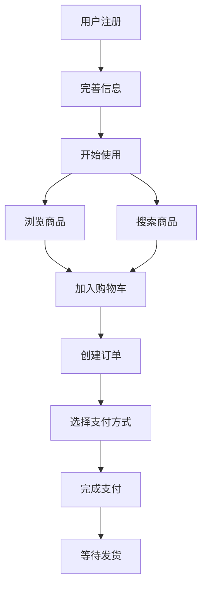

# 功能架构模式库

本文档提供常见的功能架构设计模式和最佳实践。

---

## 功能架构设计原则

### 1. 单一职责原则 (SRP)
每个功能模块只负责一个明确的职责
- ✅ 好：用户管理、订单管理、商品管理
- ❌ 差：用户订单商品综合管理

### 2. 高内聚低耦合
- **高内聚**: 模块内部功能紧密相关
- **低耦合**: 模块间依赖关系简单清晰

### 3. 分层架构
按技术或业务维度分层，层次间单向依赖

### 4. 可扩展性
预留扩展接口，支持功能迭代

---

## 功能分类体系

### 按业务价值分类

**核心功能 (Core Features)**
- 定义：产品的核心价值，用户的主要使用场景
- 特点：高频、刚需、不可或缺
- 示例：电商的商品浏览与购买、社交的发帖与互动

**支撑功能 (Supporting Features)**
- 定义：支持核心功能运转的基础能力
- 特点：用户感知弱，但必不可少
- 示例：用户认证、支付、消息通知

**增值功能 (Value-added Features)**
- 定义：提升用户体验，增加产品竞争力
- 特点：非必需，但能显著提升满意度
- 示例：个性化推荐、VIP特权、数据分析

**辅助功能 (Auxiliary Features)**
- 定义：帮助功能、运营工具
- 特点：面向特定场景或用户群
- 示例：客服系统、后台管理、数据导出

### 按用户角色分类

**C端功能 (Customer-facing)**
- 面向普通用户的功能
- 强调易用性、体验

**B端功能 (Business-facing)**
- 面向企业客户的功能
- 强调效率、数据

**管理端功能 (Admin)**
- 面向运营、管理员
- 强调权限、审核、监控

---

## 常见功能架构模式

### 模式1: 分层架构 (Layered Architecture)

```
┌─────────────────────────────────┐
│      表现层 (Presentation)       │  用户界面、API接口
├─────────────────────────────────┤
│       业务层 (Business)          │  业务逻辑、流程编排
├─────────────────────────────────┤
│       服务层 (Service)           │  通用服务、第三方集成
├─────────────────────────────────┤
│       数据层 (Data)              │  数据访问、持久化
└─────────────────────────────────┘
```

**适用场景**: 传统企业应用、管理系统

**示例**:
- 表现层：Web页面、移动端APP、API
- 业务层：订单处理、库存管理、价格计算
- 服务层：支付服务、短信服务、搜索服务
- 数据层：MySQL、Redis、文件存储

### 模式2: 领域驱动设计 (DDD)

```
┌──────────────┐  ┌──────────────┐  ┌──────────────┐
│  用户域      │  │  商品域      │  │  订单域      │
│ ┌──────────┐ │  │ ┌──────────┐ │  │ ┌──────────┐ │
│ │用户管理  │ │  │ │商品管理  │ │  │ │订单创建  │ │
│ │认证授权  │ │  │ │库存管理  │ │  │ │支付处理  │ │
│ │个人信息  │ │  │ │分类标签  │ │  │ │物流跟踪  │ │
│ └──────────┘ │  │ └──────────┘ │  │ └──────────┘ │
└──────────────┘  └──────────────┘  └──────────────┘
```

**适用场景**: 复杂业务系统、微服务架构

**核心概念**:
- **限界上下文 (Bounded Context)**: 每个域有明确边界
- **聚合根 (Aggregate Root)**: 域内的核心实体
- **领域服务 (Domain Service)**: 跨实体的业务逻辑
- **领域事件 (Domain Event)**: 域间通信机制

### 模式3: 微服务架构

```
┌────────────┐  ┌────────────┐  ┌────────────┐
│ 用户服务   │  │ 商品服务   │  │ 订单服务   │
│ • 注册登录 │  │ • CRUD     │  │ • 创建订单 │
│ • 个人中心 │  │ • 搜索     │  │ • 订单查询 │
│ • 权限管理 │  │ • 推荐     │  │ • 状态流转 │
└────────────┘  └────────────┘  └────────────┘
       │               │               │
       └───────────────┴───────────────┘
                       │
               ┌───────┴────────┐
               │   API 网关     │
               └────────────────┘
```

**适用场景**: 大型系统、团队分工明确

**特点**:
- 服务独立部署
- 数据独立存储
- 技术栈可异构
- 通过API通信

### 模式4: CQRS (读写分离)

```
         ┌─────────────┐
         │   用户请求   │
         └──────┬──────┘
                │
        ┌───────┴───────┐
        │               │
   ┌────▼────┐    ┌────▼────┐
   │ 命令端   │    │ 查询端   │
   │(Write)  │    │(Read)   │
   │         │    │         │
   │ 写库    │    │ 读库    │
   │ (主库)  │───>│ (从库)  │
   └─────────┘    └─────────┘
       数据同步
```

**适用场景**: 读写比例悬殊、高并发系统

---

## 功能模块划分方法

### 方法1: 按业务流程划分

以用户的使用路径为主线

**电商示例**:
1. 商品浏览
   - 商品搜索
   - 商品详情
   - 商品推荐
2. 购物车
   - 加入购物车
   - 购物车管理
3. 订单处理
   - 下单
   - 支付
   - 订单跟踪
4. 售后服务
   - 退换货
   - 评价晒单

### 方法2: 按数据实体划分

以核心业务对象为中心

**示例**:
- 用户模块
  - 用户信息管理
  - 认证授权
  - 等级积分
- 商品模块
  - 商品管理
  - 分类管理
  - 库存管理
- 订单模块
  - 订单创建
  - 订单流转
  - 订单查询

### 方法3: 按用户角色划分

不同角色看到不同功能集

**示例**:
- 买家端
  - 浏览商品
  - 下单购买
  - 订单管理
- 卖家端
  - 店铺管理
  - 商品上架
  - 订单处理
- 运营端
  - 数据分析
  - 活动配置
  - 审核管理

### 方法4: 按技术层次划分

技术架构驱动

**示例**:
- 接入层
  - API网关
  - 负载均衡
- 应用层
  - 业务服务
  - 定时任务
- 数据层
  - 缓存服务
  - 数据存储
- 基础层
  - 日志
  - 监控
  - 配置中心

---

## 功能流转关系

### 1. 顺序流转
功能按固定顺序执行，前一个完成才能进入下一个

```
注册 → 登录 → 完善信息 → 开始使用
```

### 2. 并行流转
多个功能可以同时进行，互不依赖

```
       ┌─→ 浏览商品
用户登录 ┼─→ 查看优惠
       └─→ 客服咨询
```

### 3. 条件流转
根据条件选择不同的流转路径

```
           ┌─→ [有货] → 加入购物车
选择商品 ──┤
           └─→ [无货] → 到货通知
```

### 4. 循环流转
功能可以重复执行

```
搜索商品 → 浏览结果 → [不满意] ──┐
                            │
                            ↓
                   [修改关键词]
```

### 5. 事件驱动
一个功能触发，引发其他功能执行

```
用户下单
  ├─→ 触发: 扣减库存
  ├─→ 触发: 发送通知
  ├─→ 触发: 生成物流单
  └─→ 触发: 记录日志
```

---

## 功能架构输出模板

### 模板1: 功能清单

| 功能模块 | 子功能 | 功能描述 | 优先级 | 依赖关系 |
|---------|--------|---------|-------|---------|
| 用户管理 | 注册 | 手机号注册，验证码验证 | P0 | 短信服务 |
| 用户管理 | 登录 | 支持手机号/邮箱登录 | P0 | 用户信息存储 |
| 商品管理 | 商品发布 | 卖家发布商品信息 | P0 | 分类管理 |

### 模板2: 功能层级图

```
系统名称
├── 用户中心
│   ├── 账户管理
│   │   ├── 注册
│   │   ├── 登录
│   │   └── 找回密码
│   ├── 个人信息
│   └── 安全设置
├── 商品中心
│   ├── 商品浏览
│   ├── 商品搜索
│   └── 商品详情
└── 交易中心
    ├── 购物车
    ├── 订单管理
    └── 支付管理
```

### 模板3: 功能矩阵

|   | 买家 | 卖家 | 管理员 |
|---|------|------|--------|
| 商品浏览 | ✓ | ✓ | ✓ |
| 商品发布 | ✗ | ✓ | ✓ |
| 订单管理 | ✓(仅自己) | ✓(店铺内) | ✓(全部) |
| 数据统计 | ✗ | ✓(店铺) | ✓(平台) |

### 模板4: 功能关系图 (Mermaid)



---

## 功能设计检查清单

设计完功能架构后，检查以下要点：

- [ ] 所有核心功能都已覆盖
- [ ] 功能划分遵循单一职责
- [ ] 没有功能重复或遗漏
- [ ] 模块间依赖关系清晰
- [ ] 功能优先级已标注
- [ ] 异常场景已考虑
- [ ] 可扩展性已预留
- [ ] 与现有系统兼容
- [ ] 技术可行性已评估

---

## 常见功能模块参考

### 用户相关
- 注册登录、个人信息、权限管理、第三方登录、实名认证

### 内容相关
- 发布、编辑、删除、审核、搜索、推荐、评论、点赞

### 交易相关
- 购物车、下单、支付、退款、发票、优惠券、积分

### 社交相关
- 关注、私信、动态、群组、话题、@提醒

### 运营相关
- 活动配置、数据统计、用户分析、内容审核、举报处理

### 通知相关
- 站内信、推送通知、短信、邮件、消息中心
