# 业务流程图规范

本文档定义使用Mermaid绘制业务流程图的标准和最佳实践。

---

## 流程图类型

### 1. 高层级概览流程图
**用途**: 展示业务的宏观流程，关注主要阶段和角色

**特点**:
- 抽象层次高，隐藏细节
- 节点数量 5-10 个
- 适合向管理层或外部人员展示

**示例场景**: 电商购物整体流程、用户注册全流程

### 2. 详细步骤流程图
**用途**: 展示具体操作步骤，包含判断分支和异常处理

**特点**:
- 操作层次，包含所有细节
- 节点数量 10-50 个
- 适合开发团队和测试团队

**示例场景**: 订单支付详细流程、商品上架审核流程

---

## Mermaid语法规范

### 基础语法

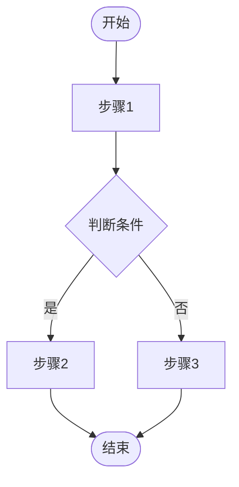

### 节点类型

| 语法 | 样式 | 用途 |
|------|------|------|
| `[矩形]` | 矩形 | 普通处理步骤 |
| `([圆角矩形])` | 圆角 | 开始/结束节点 |
| `{菱形}` | 菱形 | 判断/决策节点 |
| `[(圆柱)]` | 圆柱 | 数据存储 |
| `[/平行四边形/]` | 平行四边形 | 输入/输出 |
| `[[子流程]]` | 双边框 | 子流程引用 |

### 连接线类型

| 语法 | 样式 | 用途 |
|------|------|------|
| `-->` | 实线箭头 | 正常流转 |
| `-.->` | 虚线箭头 | 异常/可选路径 |
| `==>` | 粗箭头 | 强调的主流程 |
| `--文本-->` | 带标签 | 说明条件或动作 |

---

## 流程图绘制规范

### 1. 命名规范

**节点命名**:
- 使用动词开头：`[创建订单]`、`[验证库存]`
- 简洁明确，不超过8个字
- 避免技术术语，使用业务语言

**判断节点**:
- 以问句形式：`{库存是否充足?}`
- 或条件形式：`{支付状态}`

**分支标签**:
- 是/否、成功/失败、有/无
- 或具体条件：`已支付`、`待支付`、`已取消`

### 2. 布局规范

**高层级流程图**:

- 方向：从左到右 (LR) 或从上到下 (TD)
- 结构：线性为主，最多1-2个分支

**详细流程图**:
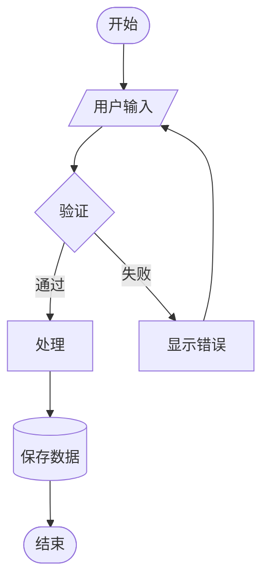
- 方向：从上到下 (TD)
- 主流程居中，异常流程靠边
- 回路清晰标注

### 3. 颜色规范（可选）

虽然Mermaid支持颜色，但为保持简洁，建议：
- 默认黑白
- 关键节点可标记（如：用红色标注风险节点）
- 不同角色可用不同颜色区分

---

## 分层绘制策略

### Level 1: 核心主流程
绘制最核心的成功路径，忽略所有异常


### Level 2: 添加主要判断
加入关键的业务判断点

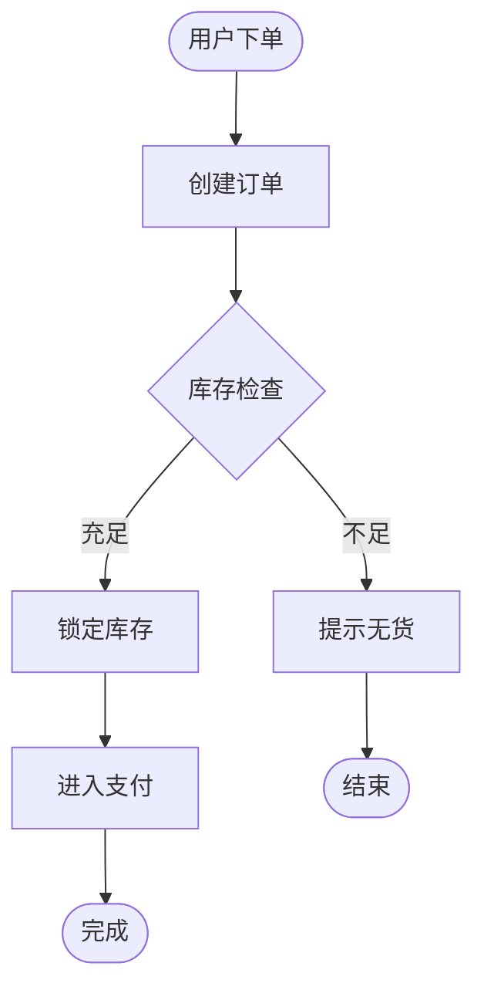

### Level 3: 完善异常流程
补充各种异常情况和边界条件

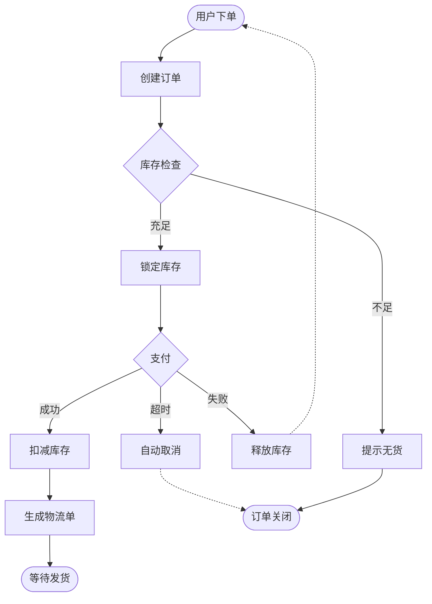

---

## 异常流程标注

### 标注方式1: 虚线表示异常
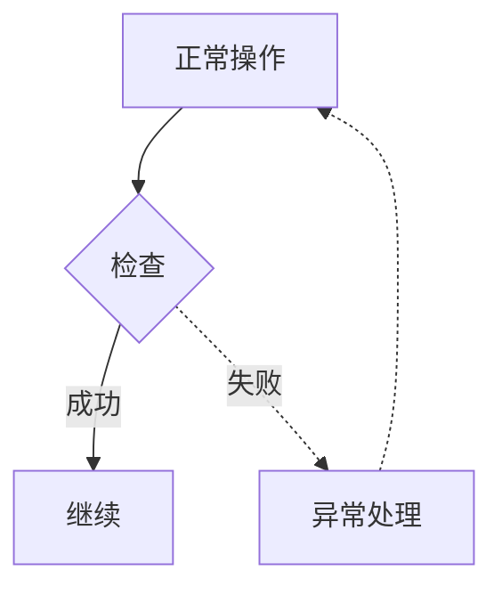

### 标注方式2: 使用子图分组
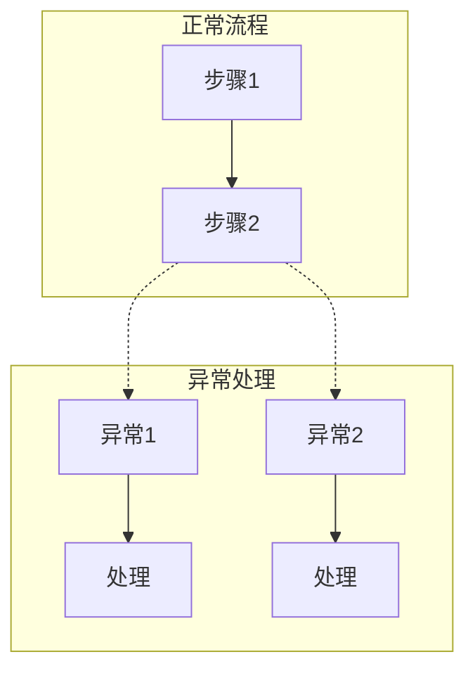

### 标注方式3: 添加注释
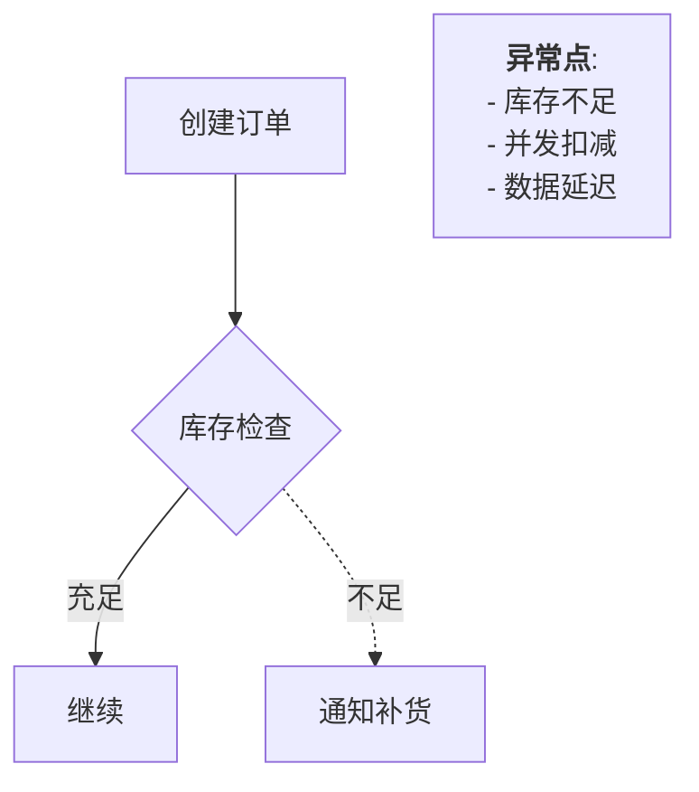

---

## 角色泳道图（可选）

当涉及多个角色协作时，使用泳道图：

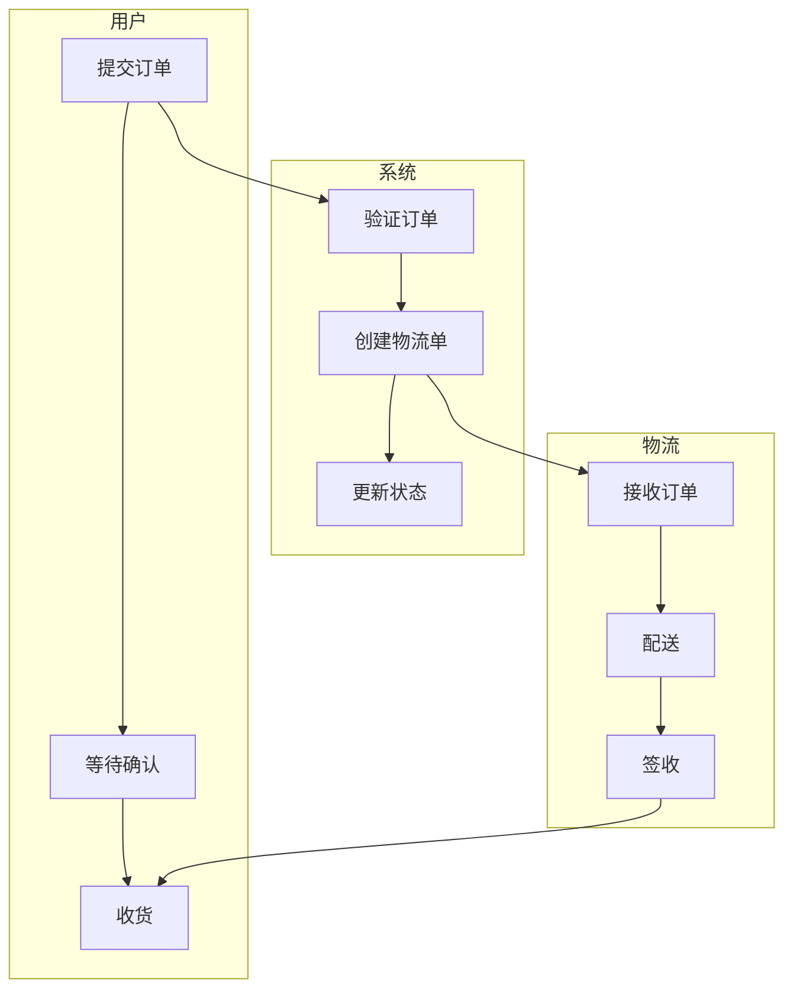

---

## 复杂流程简化技巧

### 技巧1: 提取子流程
将复杂的子流程抽取为独立图表

主流程：


支付子流程（单独绘制）：
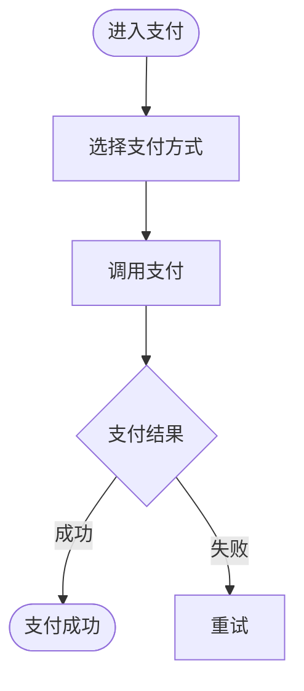

### 技巧2: 状态机图
对于复杂的状态流转，使用状态机：

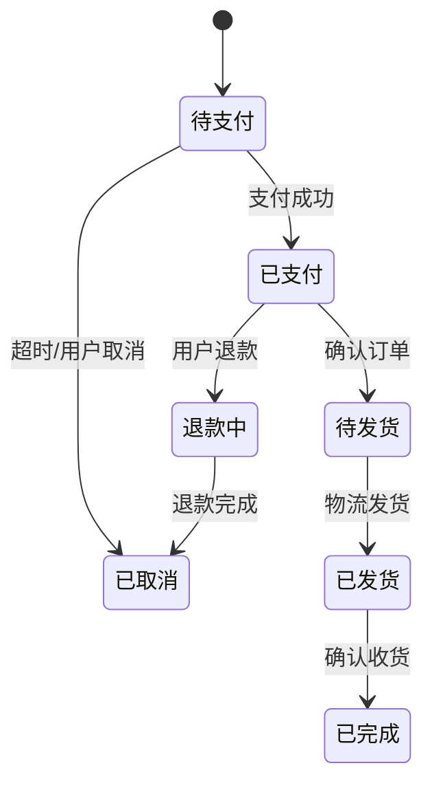

### 技巧3: 分阶段绘制
将整个流程分为多个阶段，每个阶段一张图

---

## 质量检查清单

绘制完成后，检查以下要点：

- [ ] 有且仅有一个开始节点
- [ ] 所有路径都有明确的结束
- [ ] 判断节点的所有分支都已标注
- [ ] 没有孤立的节点（无输入或无输出）
- [ ] 循环有明确的退出条件
- [ ] 异常路径清晰可辨
- [ ] 节点命名使用业务语言
- [ ] 流程符合实际业务逻辑
- [ ] 图表布局清晰，易于理解

---

## 输出格式

### 在Markdown中嵌入
````markdown
## 用户注册流程

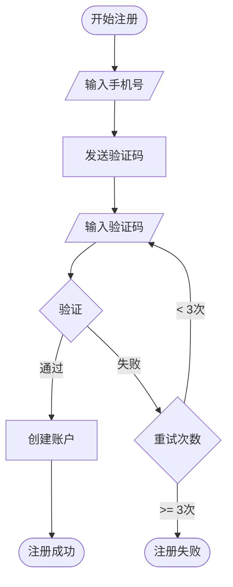
````

### 独立文件
将复杂流程图保存为独立的 `.mermaid` 或 `.md` 文件，便于维护和版本控制。
