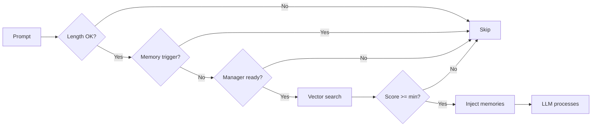
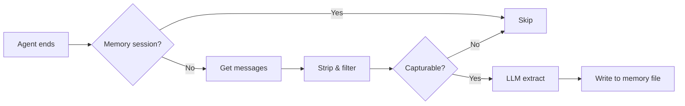

# memory-core-plus

[English](./README.md) | [中文](./README.zh-CN.md)

> Enhanced workspace memory with auto-recall and auto-capture for OpenClaw.

## Overview

`memory-core-plus` is an OpenClaw plugin that extends the built-in `memory-core` with two automated hooks:

- **Auto-Recall** -- Before each LLM turn, semantically search workspace memory and inject relevant memories into the prompt context.
- **Auto-Capture** -- After each agent run, extract durable facts, preferences, and decisions from the conversation and persist them to memory files.

Together they form a closed-loop memory system: information captured from past conversations is automatically surfaced when contextually relevant in future interactions.

## Installation

```bash
openclaw plugins install memory-core-plus
```

## Configuration

### Quick Setup

```bash
openclaw plugins install memory-core-plus
```

This single command does the following:
- Downloads and installs the plugin to `~/.openclaw/extensions/memory-core-plus/`
- Enables the plugin (`plugins.entries.memory-core-plus.enabled = true`)
- Sets the memory slot (`plugins.slots.memory = "memory-core-plus"`)
- Disables competing memory plugins (e.g. built-in `memory-core`)

Restart the gateway to load the plugin:
```bash
openclaw gateway restart
```

Auto-recall and auto-capture are both enabled by default. To disable either:
```bash
openclaw config set plugins.entries.memory-core-plus.config.autoRecall false
openclaw config set plugins.entries.memory-core-plus.config.autoCapture false
```

### Full Configuration (openclaw.json)

```jsonc
{
  "plugins": {
    "entries": {
      "memory-core-plus": {
        "enabled": true,
        "config": {
          "autoRecall": true,
          "autoCapture": true
        }
      }
    },
    "slots": {
      "memory": "memory-core-plus"
    }
  }
}
```

> **Important:** The `plugins.slots.memory` field must be set to `"memory-core-plus"` to activate this plugin as the memory provider. Running `openclaw plugins install memory-core-plus` handles slot assignment and enabling automatically. Use `openclaw plugins enable memory-core-plus` only to re-enable after a previous `plugins disable`. Do not enable `memory-core` at the same time -- they would register duplicate tools.

### Configuration Reference

| Key | Type | Default | Description |
|-----|------|---------|-------------|
| `autoRecall` | `boolean` | `true` | Enable automatic memory recall before each agent turn |
| `autoRecallMaxResults` | `number` | `5` | Maximum number of memories to inject per turn |
| `autoRecallMinPromptLength` | `number` | `5` | Minimum prompt length (chars) to trigger recall |
| `autoCapture` | `boolean` | `true` | Enable automatic memory capture after each agent run |
| `autoCaptureMaxMessages` | `number` | `10` | Maximum recent messages to analyze for capture |

## Uninstall & Rollback to memory-core

To remove this plugin and revert to the built-in `memory-core`:

```bash
# Uninstall — removes config entry, memory slot, and installed files
openclaw plugins uninstall memory-core-plus

# Restart gateway — memory-core will be used as the default memory provider
openclaw gateway restart
```

After uninstalling, the gateway falls back to the built-in `memory-core` plugin automatically. No extra configuration is needed.

## How It Works

### Auto-Recall

Registered on the `before_prompt_build` hook. Triggered every time the user sends a message, **before** the LLM processes it.



**Processing steps:**

1. When the user sends a prompt, the hook first checks whether the prompt length meets the `autoRecallMinPromptLength` threshold. Very short inputs (e.g. "hi") are skipped.
2. If the current trigger is `"memory"`, the hook exits to avoid recall during memory-related subagent runs.
3. The hook obtains the memory search manager. If no manager is available (e.g. embeddings are not configured), the hook exits.
4. The prompt is used as a query for semantic vector search across all workspace memory files.
5. Results are filtered by the core search manager's `minScore` threshold (`memorySearch.query.minScore` in `openclaw.json`). Only memories above this score are returned.
6. Matching memories are formatted as `<relevant-memories>` XML (marked as untrusted data to prevent prompt injection) and prepended to the user prompt via the hook's `prependContext` field.
7. The LLM then sees the original user question together with relevant historical context.

The recall hook skips execution when:
- The prompt is shorter than `autoRecallMinPromptLength`
- The trigger is `"memory"` (avoids recall during memory-related subagent runs)
- No memory search manager is available (e.g., no embeddings configured)

### Auto-Capture

Registered on the `agent_end` hook. Triggered every time an agent run **completes**.



**Processing steps:**

1. When an agent run completes, the hook checks recursion guards: if `ctx.trigger === "memory"` or `ctx.sessionKey` contains `:memory-capture:`, capture is skipped to prevent infinite loops.
2. The most recent user and assistant messages are extracted (up to `autoCaptureMaxMessages`).
3. Any `<relevant-memories>` blocks injected by the recall hook are stripped from the text, so previously recalled content is not re-persisted as new memory.
4. Each message is checked via `isCapturableMessage()`, which filters out: text that is too short or too long, code blocks, HTML/XML markup, headings, suspected prompt injections, and messages with excessive emojis.
5. If capturable content exists, an LLM subagent is spawned to extract durable facts, preferences, and decisions as bullet points.
6. The extracted facts are appended to `memory/YYYY-MM-DD.md`. An `idempotencyKey` prevents duplicate captures within the same run.

The capture hook includes multiple recursion guards:
- Checks `ctx.trigger === "memory"` to skip memory-triggered runs
- Checks `ctx.sessionKey` for `:memory-capture:` marker (the subagent uses this session key pattern)
- Uses `idempotencyKey` to prevent duplicate captures

## Security

- **Prompt injection detection**: Messages containing patterns like "ignore previous instructions", "you are now", "jailbreak", etc. are filtered out before capture.
- **HTML entity escaping**: All memory content injected into prompts is escaped (`&`, `<`, `>`, `"`, `'`) to prevent markup injection.
- **Untrusted data marking**: Recalled memories are wrapped in `<relevant-memories>` tags with an explicit instruction to treat them as untrusted historical data.
- **Recall marker stripping**: Before capture, any `<relevant-memories>` blocks are stripped from conversation text to avoid persisting injected context as new memories.
- **Recursion prevention**: The capture subagent's session key contains `:memory-capture:`, and the hook checks both `trigger` and `sessionKey` to break potential infinite loops.

## Relationship to memory-core

This plugin is a **superset** of the built-in `memory-core` plugin. It inherits and re-registers the same `memory_search` and `memory_get` tools, as well as the `memory` CLI command. On top of that, it adds the auto-recall and auto-capture hooks.

## License

MIT
