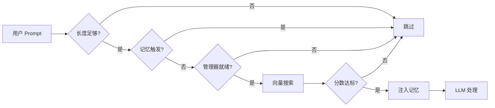
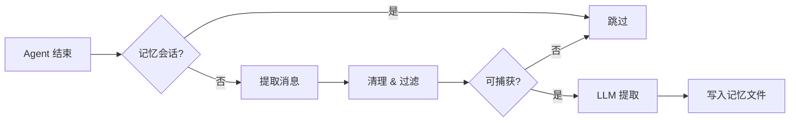

# memory-core-plus

[English](./README.md) | [中文](./README.zh-CN.md)

> OpenClaw 增强型工作区记忆插件，支持自动回忆和自动捕获。

## 概述

`memory-core-plus` 是一个 OpenClaw 插件，在内置的 `memory-core` 基础上增加了两个自动化 hook：

- **Auto-Recall（自动回忆）** -- 每次 LLM 处理前，对工作区记忆进行语义搜索，将相关记忆注入到 prompt 上下文中。
- **Auto-Capture（自动捕获）** -- 每次 agent 运行结束后，从对话中提取持久化的事实、偏好和决策，写入记忆文件。

两者形成闭环记忆系统：过去对话中捕获的信息会在未来交互中根据语义相关性自动浮现。

## 安装

```bash
openclaw plugins install memory-core-plus
```

## 配置

### 快速设置

```bash
openclaw plugins install memory-core-plus
```

这一条命令会完成以下操作：
- 下载并安装插件到 `~/.openclaw/extensions/memory-core-plus/`
- 启用插件（`plugins.entries.memory-core-plus.enabled = true`）
- 设置 memory slot（`plugins.slots.memory = "memory-core-plus"`）
- 禁用竞争的记忆插件（如内置的 `memory-core`）

重启 gateway 以加载插件：
```bash
openclaw gateway restart
```

自动回忆和自动捕获默认启用。如需关闭：
```bash
openclaw config set plugins.entries.memory-core-plus.config.autoRecall false
openclaw config set plugins.entries.memory-core-plus.config.autoCapture false
```

### 完整配置（openclaw.json）

```jsonc
{
  "plugins": {
    "entries": {
      "memory-core-plus": {
        "enabled": true,
        "config": {
          "autoRecall": true,
          "autoCapture": true
        }
      }
    },
    "slots": {
      "memory": "memory-core-plus"
    }
  }
}
```

> **重要：** `plugins.slots.memory` 必须设置为 `"memory-core-plus"` 才能将本插件激活为记忆提供者。运行 `openclaw plugins install memory-core-plus` 会自动完成 slot 分配和启用。`openclaw plugins enable memory-core-plus` 仅在之前执行过 `plugins disable` 后需要重新启用时使用。请勿同时启用 `memory-core`，否则会注册重复的工具。

### 配置参数

| 参数 | 类型 | 默认值 | 说明 |
|------|------|--------|------|
| `autoRecall` | `boolean` | `true` | 启用自动回忆（每次 agent 处理前自动搜索相关记忆） |
| `autoRecallMaxResults` | `number` | `5` | 每次注入的最大记忆条数 |
| `autoRecallMinPromptLength` | `number` | `5` | 触发回忆的最短 prompt 长度（字符数） |
| `autoCapture` | `boolean` | `true` | 启用自动捕获（每次 agent 运行结束后自动提取记忆） |
| `autoCaptureMaxMessages` | `number` | `10` | 分析捕获的最大近期消息数 |

## 卸载与回退到 memory-core

如需移除本插件并恢复使用内置的 `memory-core`：

```bash
# 卸载 — 移除配置项、memory slot 和已安装的文件
openclaw plugins uninstall memory-core-plus

# 重启 gateway — memory-core 将自动作为默认的记忆提供者
openclaw gateway restart
```

卸载后，gateway 会自动回退到内置的 `memory-core` 插件，无需额外配置。

## 工作原理

### Auto-Recall（自动回忆）

注册在 `before_prompt_build` hook 上。每次用户发送消息、LLM 处理**之前**触发。



**处理步骤：**

1. 用户发送 prompt 后，hook 首先检查 prompt 长度是否达到 `autoRecallMinPromptLength` 阈值。过短的输入（如 "hi"）会被跳过。
2. 如果当前 trigger 为 `"memory"`，hook 退出，避免在记忆相关的 subagent 运行中触发回忆。
3. hook 获取记忆搜索管理器。如果管理器不可用（例如未配置 embeddings），则退出。
4. 将用户 prompt 作为查询语句，对工作区所有记忆文件进行向量语义搜索。
5. 核心 search manager 按 `minScore` 阈值过滤结果（`openclaw.json` 中的 `memorySearch.query.minScore`），仅返回分数达标的记忆。
6. 匹配的记忆被格式化为 `<relevant-memories>` XML（标记为不可信数据以防止 prompt injection），通过 hook 的 `prependContext` 字段注入到用户 prompt 前部。
7. LLM 最终看到原始用户问题和相关的历史上下文。

以下情况会跳过回忆：
- prompt 长度短于 `autoRecallMinPromptLength`
- trigger 为 `"memory"`（避免在记忆相关的 subagent 运行中触发回忆）
- 记忆搜索管理器不可用（例如未配置 embeddings）

### Auto-Capture（自动捕获）

注册在 `agent_end` hook 上。每次 agent 运行**结束后**触发。



**处理步骤：**

1. 当 agent 运行结束后，hook 检查递归防护：如果 `ctx.trigger === "memory"` 或 `ctx.sessionKey` 包含 `:memory-capture:`，则跳过捕获以防止无限循环。
2. 提取最近的 user 和 assistant 消息（最多 `autoCaptureMaxMessages` 条）。
3. 移除文本中由 recall hook 注入的所有 `<relevant-memories>` 块，避免将之前回忆的内容重新持久化为新记忆。
4. 通过 `isCapturableMessage()` 检查每条消息，过滤掉：过短或过长的文本、代码块、HTML/XML 标记、标题、疑似 prompt injection、以及包含过多 emoji 的消息。
5. 如果存在可捕获的内容，启动 LLM subagent 以 bullet point 形式提取持久化的事实、偏好和决策。
6. 提取的事实追加写入 `memory/YYYY-MM-DD.md`。通过 `idempotencyKey` 防止同一次运行中的重复捕获。

捕获 hook 包含多重递归防护：
- 检查 `ctx.trigger === "memory"` 跳过记忆触发的运行
- 检查 `ctx.sessionKey` 是否包含 `:memory-capture:` 标记（subagent 使用此 session key 模式）
- 使用 `idempotencyKey` 防止重复捕获

## 安全机制

- **Prompt injection 检测**：包含 "ignore previous instructions"、"you are now"、"jailbreak" 等模式的消息会在捕获前被过滤。
- **HTML 实体转义**：注入 prompt 的所有记忆内容会进行 HTML 转义（`&`、`<`、`>`、`"`、`'`），防止标记注入。
- **不可信数据标记**：回忆的记忆以 `<relevant-memories>` 标签包裹，并附带明确指令将其视为不可信的历史数据。
- **回忆标记清除**：捕获前会从对话文本中移除所有 `<relevant-memories>` 块，避免将注入的上下文作为新记忆持久化。
- **递归防护**：捕获 subagent 的 session key 包含 `:memory-capture:`，hook 同时检查 `trigger` 和 `sessionKey` 以打破潜在的无限循环。

## 与 memory-core 的关系

本插件是内置 `memory-core` 插件的**超集**。它继承并重新注册了相同的 `memory_search` 和 `memory_get` 工具，以及 `memory` CLI 命令。在此基础上增加了 auto-recall 和 auto-capture hook。

## 许可证

MIT
