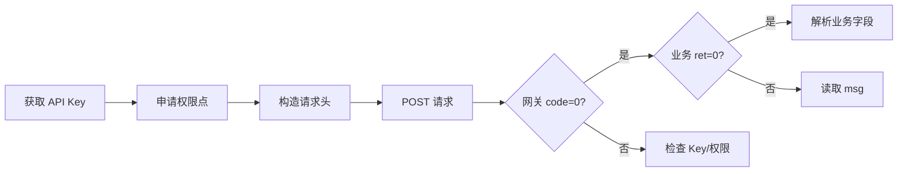

# ziniao-erp-api-doc（紫鸟ERP API 文档）

## 何时使用 / 不使用

| 场景 | 做法 |
|------|------|
| 需要了解紫鸟 API 的能力和模块 | 读本 Skill |
| 需要了解接口权限点以申请开通 | 读本 Skill §权限点汇总 |
| 需要做 ERP 对接的集成设计 | 读本 Skill |
| 需要查阅某个接口的详细参数 | 读本 Skill §按需深入，再读 reference/ 文件 |

---

## Level 0：定位与边界

### 是什么

紫鸟ERP REST API，面向 ERP/第三方系统，通过"简单通用模式"（Bearer API Key）认证，实现紫鸟浏览器的企业级管理——涵盖账号、设备、访问策略、角色权限、部门员工五大模块，共 72 个接口。

### 能力概览

| 能力域 | 接口数 | 说明 |
|--------|--------|------|
| 账号管理 | 22 | 账号 CRUD、授权管理、标签体系、缓存清除 |
| 设备管理 | 11 | 套餐/设备购买续费、绑定解绑、自有设备管理 |
| 访问策略 | 22 | 网页/分组管理、访问规则 CRUD、账号策略绑定 |
| 角色和权限 | 7 | 角色 CRUD、权限列表、用户角色调整 |
| 部门员工 | 10 | 部门 CRUD/移动、员工新增/修改/查询/启禁用 |

### 不做什么（边界）

- 不包含 OAuth 授权模式（仅覆盖简单通用模式）
- 不包含浏览器指纹配置或窗口管理
- 不包含账单/支付明细（仅含设备购买/续费操作）
- 不包含企业创建/注销等顶级管理

---

## Level 1：架构与流程

### 核心概念

**API Key 认证**：在开放平台创建"卖家自研应用"并选择"简单通用模式"获取 API Key。请求头：`Authorization: Bearer {API_Key}`。

**双层响应结构**：网关层（request_id / code / msg / data(业务层)）+ 业务层（ret / status / msg + 业务字段）。网关 code="0" 到达业务层；业务 ret=0 操作成功。失败时额外返回 sub_code / sub_msg。注意：业务数据不一定在业务层的 data 字段中，部分接口的业务字段直接位于业务层根级（参见各 reference 文件中的响应说明）。

**核心 ID 体系**：companyId（紫鸟企业ID，几乎所有接口必传，可在开放平台首页右侧获取）、storeId（账号ID）、userId/staffId（用户ID）、proxyId（设备ID）、tagId/tid（标签ID）、roleId（角色ID）、ruleId（规则ID）。

**权限点体系**：每个接口归属一个"所属权限点"，应用需在开放平台申请开通对应权限后才能调用。多个接口可共享同一权限点。

### 调用流程



Base URL：`https://sbappstoreapi.ziniao.com/openapi-router`

### 权限点汇总

应用需在开放平台申请开通以下权限点，才能调用对应接口：

| 模块 | 需申请的权限点 |
|------|-------------|
| 账号管理 | ERP-创建与删除账号权限、ERP-账号查看权限、ERP-编辑账号基础信息、ERP-账号授权权限、ERP-清除账号授权、ERP-清除账号缓存、ERP-查询某用户有权限的账号列表、ERP-标签列表、账号标签管理权限 |
| 设备管理 | ERP-设备套餐列表查询权限、ERP-设备购买与续费权限、ERP-设备绑定权限、ERP-设备查询、ERP-开关自动续费、ERP-查询已购设备价格接口、ERP-解绑设备、ERP-添加自有设备（新）、ERP-修改自有设备信息（新） |
| 访问策略 | ERP-网页访问权限（覆盖全部 22 个访问策略接口） |
| 角色权限 | ERP-角色添加、修改权限、ERP-角色列表查询、ERP-角色详情、ERP-权限列表 |
| 部门员工 | ERP-部门与员工接口、ERP-用户的部门变更 |

每个 reference 文件中标注了各接口的具体权限点归属。

### 公共响应结构

```json
{
  "request_id": "全局请求追踪ID",
  "code": "0",
  "msg": "SUCCESS",
  "data": {
    "ret": 0,
    "status": "success",
    "data": [],
    "msg": "",
    "count": 0
  }
}
```

> **注意**：业务数据位置因接口而异。多数接口的业务数据在 `data.data` 中，但部分接口的业务字段直接在业务层根级（与 ret/status 同级）。例如"ERP-员工新增v2"返回的 id、password 直接在业务层，不在 data 字段内。请以各 reference 文件中"响应 data"或"响应"的标注为准——标注"响应 data"表示数据在 data 字段中，标注"响应"则表示字段在业务层根级。

### 环境约定

- 请求编码：UTF-8，Content-Type：application/json
- 域名：`https://sbappstoreapi.ziniao.com/openapi-router`
- 几乎所有接口均为 POST + JSON body
- 前提：创建"卖家自研应用"，选择"简单通用模式"，申请所需权限点，配置 IP 白名单

---

## 按需深入（Level 2 路由表）

> **规则：以下内容不要主动加载。**
> 仅在需要了解某个细节时，按路由表读取对应的 reference/ 文件。

| 你需要了解 | 读取文件 |
|-----------|---------|
| 认证方式、请求构造、代码示例（Java/Python/JS）、常见错误 | `reference/api-guide.md` |
| 账号创建/删除/编辑/列表查询/标签列表/缓存清除 | `reference/account-crud.md` |
| 账号授权新增/删除/查询/清除/授权用户列表 | `reference/account-auth.md` |
| 标签添加/删除/重命名/绑定/解绑/替换/移除/清空/列表 | `reference/account-tags.md` |
| 设备套餐/购买/续费/绑定/解绑/查询/自有设备管理 | `reference/device-management.md` |
| 网页增删改查/网页分组管理 | `reference/access-policy-web.md` |
| 访问规则新建/编辑/删除/启禁用/详情/成员账号设置 | `reference/access-policy-rules.md` |
| 角色增改查/权限列表/用户角色调整 | `reference/roles-permissions.md` |
| 部门增删改查移动/员工增改查启禁用/部门变更 | `reference/department-staff.md` |
