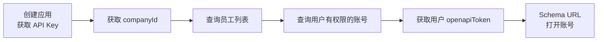

# ziniao-sso-doc（紫鸟单点登录 API 文档）

## 何时使用 / 不使用

| 场景 | 做法 |
|------|------|
| 需要了解紫鸟单点登录能做什么 | 读本 Skill |
| 需要做 ERP SSO 对接的集成设计 | 读本 Skill |
| 需要查阅某个接口的请求/响应参数 | 读本 Skill §按需深入 获取路径，再读 reference/ 文件 |
| 需要 Schema URL 协议详细参数 | 读 `reference/client-schema.md` |

---

## Level 0：定位与边界

### 是什么

紫鸟单点登录 OpenAPI，面向 ERP/第三方系统，通过服务端 API 获取认证令牌，结合 `superbrowser://` Schema URL 协议拉起紫鸟浏览器并自动登录指定账号，实现免密单点登录。支持两种鉴权模式：简单鉴权（直接用 API Key，无需调用 get_app_token）和复杂鉴权（需额外获取 appAuthToken）。

### 能力概览

| 能力域 | 说明 |
|--------|------|
| 应用认证 | 获取应用级 Token（appAuthToken）——仅复杂鉴权模式需要，简单鉴权模式直接用 API Key |
| 企业信息 | 获取自建应用关联的公司 ID（companyId） |

| 员工查询 | 分页查询公司员工列表，支持按角色/状态/部门筛选 |
| 账号查询 | 查询公司全部账号或指定用户有权限的账号列表 |
| 用户登录 | 获取指定用户的登录 Token（openapiToken），用于 SSO 鉴权 |
| 客户端控制 | 通过 Schema URL 打开/关闭账号、退出浏览器（仅 Windows） |

### 不做什么（边界）

- 不包含账号 CRUD（创建/删除/编辑）——见 ziniao-erp-api-doc
- 不包含标签、授权、设备管理接口——见 ziniao-erp-api-doc
- 不提供浏览器自动化（RPA/脚本注入）能力
- Schema URL 仅支持 Windows 客户端

---

## Level 1：架构与流程

### 核心概念

**两种鉴权模式**：**简单鉴权模式**——直接用 API Key 放入 `Authorization: Bearer {API_Key}` 请求头，无需调用 `get_app_token`；**复杂鉴权模式**——需先调用 `get_app_token` 获取 appAuthToken 再进行后续调用。大多数场景使用简单鉴权即可。

**用户登录 Token**：openapiToken，通过 `user-login` 接口获取，有过期时长，用于 Schema URL 拉起浏览器时的用户身份鉴权。

**Schema URL 协议**：以 `superbrowser://` 为前缀的自定义 URL 协议，支持三个 Action：OpenStrore（打开账号）、CloseStrore（关闭账号）、exit（退出浏览器）。可通过浏览器链接或命令行 `SuperBrowser.exe "url"` 调用。

**双层响应结构**：网关层（request_id / code / msg）+ 业务层（ret / status / data / msg）。网关 code="0" 表示请求到达业务层；业务 ret=0 表示操作成功。

### SSO 集成全流程



1. 在开放平台创建自建应用，获取 API Key（简单鉴权模式）
2. 调用 `builtin/company` 获取 companyId（固定值，获取一次即可）
3. 调用 `staff/list` 查询员工，获取 userId
4. 调用 `user/stores` 查询该用户有权限的账号，获取 storeId
5. 调用 `user-login` 获取用户的 openapiToken（需提前申请接口权限）
6. 拼接 Schema URL：`superbrowser://OpenStrore?storeId={storeId}&openapiToken={token}&userId={userId}`

> 如使用复杂鉴权模式，需在步骤 1 之后额外调用 `get_app_token` 获取 appAuthToken。

### 接口摘要表

| 分组 | 接口名称 | 路径 | 方法 |
|------|---------|------|------|
| 认证 | 获取应用 token（仅复杂鉴权模式） | /auth/get_app_token | POST |
| 企业 | 获取公司信息 | /app/builtin/company | GET |
| 员工 | ERP-员工查询 | /superbrowser/rest/v1/erp/staff/list | POST |
| 账号 | ERP-账号列表查询 | /superbrowser/rest/v1/erp/store/list | POST |
| 账号 | ERP-查询用户有权限的账号 | /superbrowser/rest/v1/erp/user/stores | POST |
| 登录 | 获取用户登录 token | /superbrowser/rest/v1/token/user-login | POST |

### 公共响应结构

> **所有接口返回双层嵌套结构，解析时必须先剥离网关层再读业务层。**
> **异常处理：请求异常时，必须将 request_id、msg 和 sub_msg 都打印出来，便于追踪定位。**

```json
{
  "request_id": "全局请求追踪ID",
  "code": "0",        // ← 网关层：code="0" 表示请求到达业务层
  "msg": "SUCCESS",
  "sub_code": "",      // ← 业务返回码，成功时不返回
  "sub_msg": "",       // ← 业务返回码描述，成功时不返回
  "data": { ... }     // ← 业务层：各接口文档中的响应参数均在此内部
}
```

### 环境约定

- Base URL：`https://sbappstoreapi.ziniao.com/openapi-router`
- 请求编码：UTF-8，Content-Type：application/json
- 前提：在开放平台创建"卖家自研应用"，获取 API Key，申请所需权限点，配置 IP 白名单
- `user-login` 接口需联系紫鸟客服申请权限（需 Boss 验证）

---

## 按需深入（Level 2 路由表）

> **规则：以下内容不要主动加载。**
> 仅在你明确需要了解某个细节时，按路由表读取对应的 reference/ 文件。

| 你需要了解 | 读取文件 |
|-----------|---------|
| 认证接口详细参数（get_app_token + user-login） | `reference/account-auth.md` |
| 企业信息、员工查询、账号查询接口的详细参数 | `reference/account-crud.md` |
| Schema URL 协议详细参数（OpenStrore / CloseStrore / exit） | `reference/client-schema.md` |
| API 使用指南（基地址、公共 Headers、公共响应、curl 示例） | `reference/api-guide.md` |
