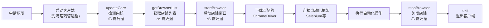

# ziniao-webdriver-doc（紫鸟 WebDriver 文档）

## 何时使用 / 不使用

| 场景 | 做法 |
|------|------|
| 需要理解紫鸟 WebDriver 是什么、能做什么 | 读本 Skill |
| 需要做自动化集成/框架选型的设计决策 | 读本 Skill |
| 需要查阅某个接口的请求/响应格式 | 读本 Skill 的 §按需深入 获取路径，再读对应 reference/ 文件 |
| 需要查看各语言/框架示例代码 | 不读本 Skill → 直接读 `reference/framework-examples.md` |

---

## Level 0：定位与边界

### 是什么

紫鸟浏览器 WebDriver 是紫鸟浏览器提供的本地自动化控制接口。通过命令行参数启动紫鸟浏览器进入 WebDriver 模式后，浏览器在本地开启 HTTP 服务，开发者可通过 JSON API 管理店铺窗口，并使用 Selenium / Puppeteer / Playwright / DrissionPage 等框架对接调试端口，实现对店铺浏览器的自动化控制。

### 能力概览

| 能力域 | 说明 |
|--------|------|
| 客户端启动控制 | 命令行参数启动/退出紫鸟浏览器进入 WebDriver 模式 |
| 认证与登录 | 通过 API 完成设备授权、账号登录、获取店铺列表 |
| 店铺窗口管理 | 启动/关闭指定店铺窗口，获取调试端口(debuggingPort) |
| 自动化框架对接 | 返回调试端口供 Selenium/Puppeteer/Playwright/DrissionPage 连接 |
| 内核管理 | 检测/下载/更新浏览器内核 |
| 缓存与会话 | 清理本地/在线缓存、管理 Cookie 策略 |
| 插件管理 | 启动店铺时加载指定插件、查询插件安装状态 |

### 不做什么（边界）

- 不是通用浏览器自动化方案——仅适用于紫鸟浏览器客户端
- 不提供 WebDriver 驱动本身——需根据返回的 `core_version` 自行下载匹配版本的 ChromeDriver
- 不处理电商平台业务逻辑——仅提供浏览器窗口控制能力
- 不提供云端部署——仅支持本地运行（通过 `--listen_ip` 可开放远程控制）

---

## Level 1：架构与流程

### 核心概念

**WebDriver 模式**：通过 `--run_type=web_driver` 参数启动紫鸟浏览器，使其进入自动化控制模式。此模式下浏览器在本地指定端口开启 HTTP 服务，接受 JSON 格式的 API 调用。启动前必须关闭紫鸟主进程。

**HTTP IPC 通信**：所有 API 均为 POST 请求，JSON 格式，UTF-8 编码。通过 `--port` 参数指定通信端口，地址为 `http://127.0.0.1:{port}`。每个请求需携带 `action` 字段标识操作类型、`requestId` 做全局唯一标识。超时建议 120 秒以上。

**店铺窗口（browserOauth / browserId）**：紫鸟以"店铺"为最小管理单位。调用 `getBrowserList` 获取店铺列表及加密 ID（`browserOauth`），然后通过 `startBrowser` 启动指定店铺窗口，返回 `debuggingPort` 用于自动化框架连接。若直接使用 `getBrowserList` 返回值打开店铺，只需传 `browserOauth`；仅当需要以明文店铺 ID 打开时才赋值 `browserId`。

**内核版本匹配**：`startBrowser` 返回 `core_type`（如 Chromium）和 `core_version`（如 119.1.0.16），开发者必须使用对应大版本号的 ChromeDriver（如 119.x）连接，否则自动化将失败。

### 流程全景



1. **申请权限**：在紫鸟开放平台开通 WebDriver 权限
2. **启动客户端**：先清理残留进程（见§关键陷阱），再命令行启动紫鸟浏览器，必须参数：`--run_type=web_driver --ipc_type=http --port={端口}`
3. **updateCore**：**必须携带 company/username/password**，轮询检测内核是否就绪（statusCode==0），缺失时自动下载
4. **getBrowserList**：传入 company/username/password，获取店铺列表
5. **startBrowser**：传入 company/username/password + browserOauth，返回 debuggingPort 和 core_version
6. **下载 ChromeDriver**：根据 `core_version` 大版本号下载匹配的 ChromeDriver（**不是系统 Chrome 版本**）
7. **连接框架**：用 `127.0.0.1:{debuggingPort}` + 匹配版本的 ChromeDriver 连接 Selenium 等
8. **关闭**：`stopBrowser`（需凭据）关闭店铺窗口，`exit` 退出客户端

### 能力摘要表

| 接口 Action | 职责 | 关键输入 | 关键输出 | 需凭据 |
|-------------|------|---------|---------|:------:|
| updateCore | 检测/下载内核 | **company, username, password** | statusCode, msg(进度) | **是** |
| applyAuth | 设备授权 | company, username, password | statusCode | **是** |
| getBrowserList | 获取店铺列表 | company, username, password | browserList[{browserOauth, browserName, siteId...}] | **是** |
| startBrowser | 启动店铺窗口 | company, username, password, browserOauth/browserId | debuggingPort, core_version, core_type | **是** |
| stopBrowser | 关闭店铺窗口 | company, username, password, browserOauth/browserId | statusCode | **是** |
| logout | 退出登录 | 无 | statusCode | 否 |
| exit | 退出客户端进程 | 无 | statusCode | 否 |
| ClearCache | 清理本地缓存 | browserOauths[] | statusCode | 否 |
| ClearOnline | 清理在线缓存 | company, username, password, browserOauth, type(1/2/3) | statusCode | **是** |
| getPluginInstalled | 查询插件安装状态 | browserId, pluginIds | install_status | 否 |
| getRunningInfo | 获取已开启的店铺 | 无 | browsers[] | 否 |

### 关键陷阱

> **以下均为实战中高频踩坑点，务必在编写自动化脚本时严格遵守。**

#### 陷阱 1：凭据一致性

所有标记"需凭据"的接口（`updateCore`、`getBrowserList`、`startBrowser`、`stopBrowser`、`ClearOnline`）**每次调用都必须携带完整的 company/username/password**，不只是"登录类"接口。`updateCore` 尤其容易遗漏——它看似只是内核检测，但紫鸟服务端需要凭据验证身份后才返回内核状态。

#### 陷阱 2：错误信息处理

API 返回错误时，**优先读取 `err` 字段的内容来定位问题**，而非仅依赖 `statusCode` 数字。`err` 字段包含具体的中文错误描述，是最有价值的排障信息。

编码注意：`err` 中的中文可能因响应体未正确按 UTF-8 解码而出现乱码，导致无法定位根因。**务必确保 HTTP 客户端以 UTF-8 解码响应体**（Python `requests` 库需设置 `response.encoding = 'utf-8'`，或使用 `response.content.decode('utf-8')`）。

#### 陷阱 3：进程残留清理

紫鸟启动失败或异常退出后，可能残留多个子进程（主进程 + 内核进程），如果不清理就重启会导致端口占用、反复失败。**每次启动前和失败后重试前，必须确保所有紫鸟相关进程已终止。**

清理命令：

```bash
# Windows (PowerShell)
Get-Process | Where-Object { $_.ProcessName -match 'ziniao|ZiNiao' } | Stop-Process -Force

# macOS / Linux
pkill -f ziniao || true
```

#### 陷阱 4：ChromeDriver 版本必须匹配紫鸟内核

紫鸟浏览器的内核版本（`core_version`）**与系统安装的 Chrome 浏览器版本无关**。必须根据 `startBrowser` 返回的 `core_version` 提取大版本号（如 `119.1.0.16` → `119`），下载对应版本的 ChromeDriver。

建议策略：
1. 首次获取 `core_version` 后，检查本地缓存目录是否已有该大版本的 ChromeDriver
2. 若无，从 https://googlechromelabs.github.io/chrome-for-testing/ 下载对应版本
3. 缓存到本地目录（如 `./chromedriver_cache/{major_version}/chromedriver`），后续复用

### 环境约定

| 项目 | 要求 |
|------|------|
| Windows | 紫鸟 V5 (5.X.X.X) 或 V6 (6.16.0.126+) |
| macOS | 紫鸟 V6 (6.15.0.44+) |
| Linux | 紫鸟 V6 (6.25.3.3+) |
| 通信协议 | HTTP POST, JSON, UTF-8 |
| 超时设置 | ≥ 120 秒 |
| 启动前提 | 紫鸟主进程必须已完全关闭 |
| 推荐框架 | Selenium（Playwright/Puppeteer 会被检测为自动化） |

---

## 按需深入（Level 2 路由表）

> **规则：以下内容不要主动加载。**
> 仅在你明确需要了解某个细节时，按路由表读取对应的 reference/ 文件。

| 你需要了解 | 读取文件 |
|-----------|---------|
| 核心工作流接口（applyAuth/getBrowserList/startBrowser） | `reference/api-core.md` |
| 辅助管理接口（stopBrowser/logout/exit/缓存/插件/updateCore） | `reference/api-auxiliary.md` |
| 启动客户端的命令行参数详细说明 | `reference/startup-params.md` |
| 各语言/框架的示例代码与下载链接 | `reference/framework-examples.md` |
| 权限开通、账号配置、常见问题排查 | `reference/prerequisites.md` |
