<skill>
name: aha-mermaid-diagram
model: fast
version: 1.1.0
description: >
  Create professional software diagrams using Mermaid syntax. Expert in all diagram types:
  Class, Sequence, Flowchart, ERD, C4 Architecture, State, Git Graphs, Gantt Charts.
  Includes HTML rendering, theming, styling, and interactive features.
  Triggers: diagram, visualize, model, architecture, flow, domain model, ERD, sequence.
tags: [diagrams, mermaid, visualization, architecture, documentation, modeling, class-diagram, flowchart, sequence-diagram]
</skill>

# Aha Mermaid Diagram Expert

Professional Mermaid.js diagrams for software architecture, domain modeling, and system visualization.

## Installation

### CDN (HTML)

```html
<script type="module">
  import mermaid from 'https://cdn.jsdelivr.net/npm/mermaid@10/dist/mermaid.esm.min.mjs';
  mermaid.initialize({ startOnLoad: true });
</script>
<pre class="mermaid">
  flowchart LR
    A --> B
</pre>
```

### CLI Export

```bash
npm install -g @mermaid-js/mermaid-cli
mmdc -i input.mmd -o output.png -w 1920 -H 1080
```

## Core Syntax

All Mermaid diagrams:
```
diagramType
  definition content
```

**Key principles:**
- First line declares type: `classDiagram`, `sequenceDiagram`, `flowchart`, `erDiagram`, `C4Context`, `stateDiagram`, `gantt`
- Use `%%` for comments
- Line breaks improve readability
- Unknown words break diagrams; invalid parameters fail silently
- Avoid `{}` in comments

## Diagram Type Selection

| Type | Use For | Best Practice |
|------|---------|---------------|
| **Class Diagram** | Domain modeling, OOP design, entity relationships | Show attributes + methods |
| **Sequence Diagram** | API flows, auth flows, component interactions | Use activations, autonumber |
| **Flowchart** | Processes, algorithms, decision trees, user journeys | Keep <15 nodes per diagram |
| **ERD** | Database schemas, table relationships | UPPERCASE entity names |
| **C4 Diagrams** | System context, containers, components, architecture | 4 levels: Context→Container→Component→Code |
| **State Diagram** | State machines, lifecycle states | Use choice nodes for transitions |
| **Git Graphs** | Branching strategies | Show merges clearly |
| **Gantt Charts** | Project timelines, scheduling | Group by category |

## Class Diagram (Domain Model)

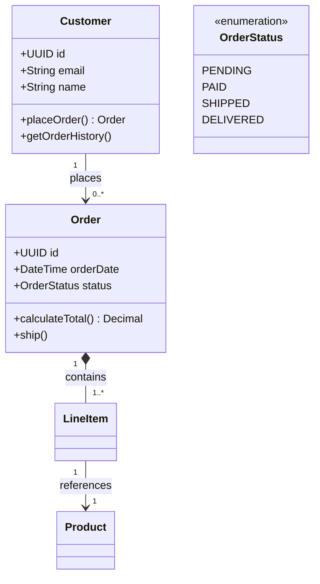

**Visibility modifiers:** `+` public, `-` private, `#` protected, `~` package

**Relationships:**
- `--` Association (loose relationship)
- `*--` Composition (strong ownership, child dies with parent)
- `o--` Aggregation (weak ownership, child can exist alone)
- `<|--` Inheritance ("is-a")
- `<..` Dependency (parameter/local variable)
- `<|..` Implementation (interface)

## Sequence Diagram (API Flow)

```mermaid
sequenceDiagram
    autonumber
    actor User
    participant Frontend
    participant API
    participant Database
    
    User->>+Frontend: Enter credentials
    Frontend->>+API: POST /auth/login
    
    API->>+Database: Query user
    Database-->>-API: User record
    
    alt Valid credentials
        API->>API: Generate JWT
        API-->>-Frontend: 200 OK + JWT
        Frontend-->>-User: Redirect to dashboard
    else Invalid
        API-->>-Frontend: 401 Unauthorized
        Frontend-->>User: Show error
    end
```

**Message types:** `->>` solid request, `-->>` dotted response, `-)` async

**Structures:** `alt/else/end`, `opt`, `par/and/end`, `loop`, `break`

**Tips:** Use activations (`+`/`-`), autonumber, descriptive notes

## Flowchart (Process/Decision)

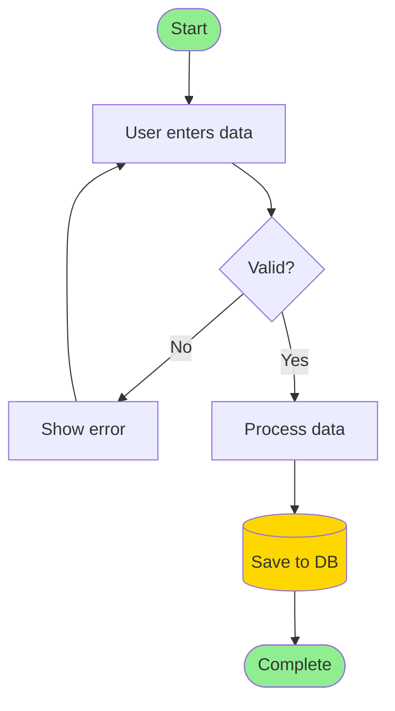

**Directions:** TD/TB (top-down), BT (bottom-up), LR (left-right), RL (right-left)

**Node shapes:**
- `[Text]` Rectangle
- `([Text])` Stadium/pill
- `[[Text]]` Subroutine
- `[(Text)]` Cylinder (database)
- `((Text))` Circle
- `{Text}` Rhombus (decision)
- `{{Text}}` Hexagon
- `[/Text/]` Parallelogram (IO)
- `[>Text]` Asymmetric/flag

**Connections:** `-->` arrow, `---` open, `-.->` dotted, `==>` thick

## ERD (Database Schema)

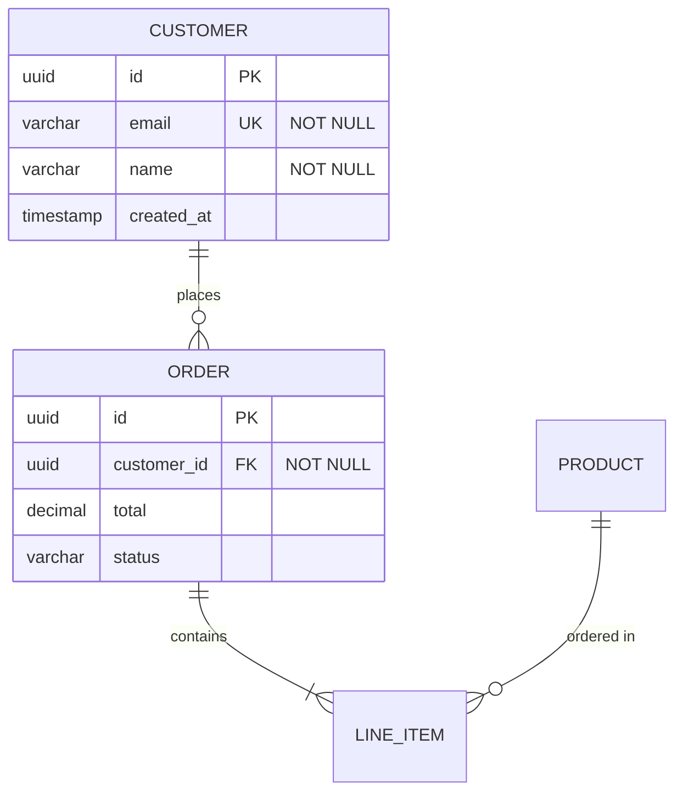

**Cardinality:** `||` exactly one, `|o` zero or one, `}{` one or many, `}o` zero or many

**Constraints:** PK (primary key), FK (foreign key), UK (unique), NN (not null)

## C4 Architecture Diagrams

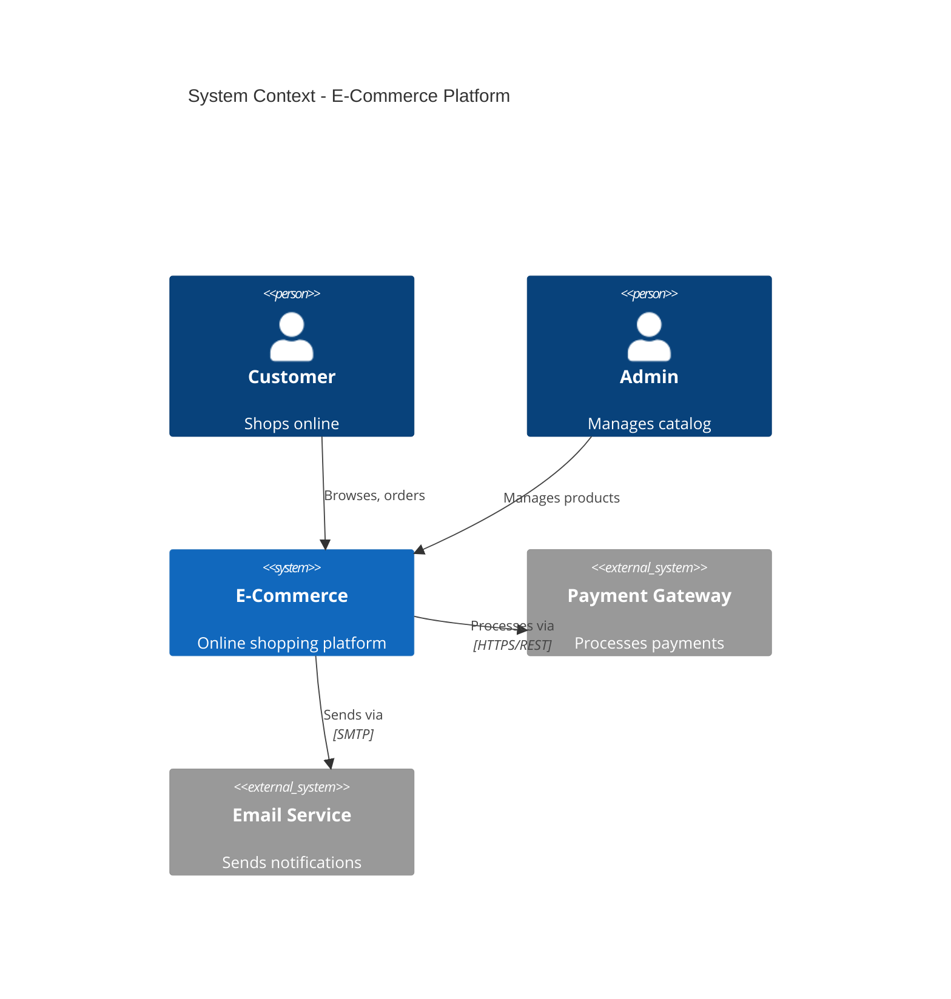

**Levels:** C4Context → C4Container → C4Component → Class diagrams

**Elements:** Person, System, System_Ext, SystemDb, SystemQueue, Container, ContainerDb, ContainerQueue, Component

## Advanced Configuration

### Theme Variables

```javascript
mermaid.initialize({
  theme: 'dark',
  themeVariables: {
    primaryColor: '#3b82f6',
    primaryTextColor: '#f1f5f9',
    primaryBorderColor: '#8b5cf6',
    lineColor: '#06b6d4',
    background: '#111827',
    mainBkg: '#1e293b'
  }
});
```

**Available themes:** default, forest, dark, neutral, base

### Layout Options

```javascript
// Dagre (default) - balanced layout
// ELK - better for complex diagrams
mermaid.initialize({
  layout: 'elk',
  elk: {
    mergeEdges: true,
    nodePlacementStrategy: 'BRANDES_KOEPF'
  }
});
```

### Look Options

```javascript
mermaid.initialize({
  look: 'classic'   // Traditional
  // or
  look: 'handDrawn' // Sketch-like
});
```

### HTML Rendering Config

```javascript
mermaid.initialize({
  startOnLoad: false,
  maxTextSize: 99999,
  fontSize: 14,
  securityLevel: 'loose'
});
```

## Styling

### Node Styling

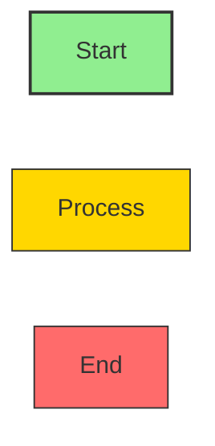

### Link Styling

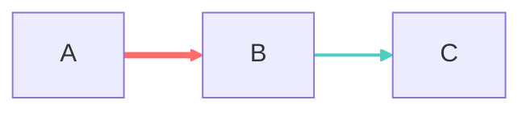

### Subgraph Styling

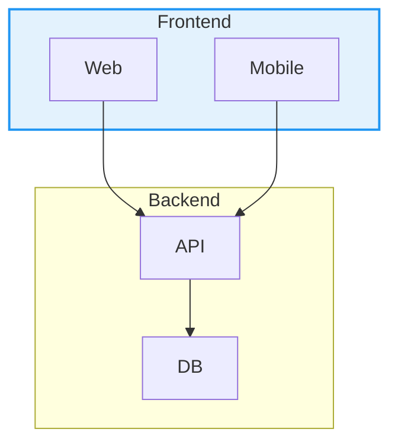

## Interactive Features

### Click Events & Links

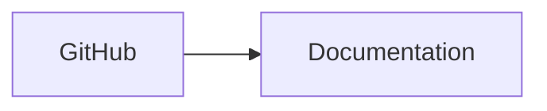

### Tooltips

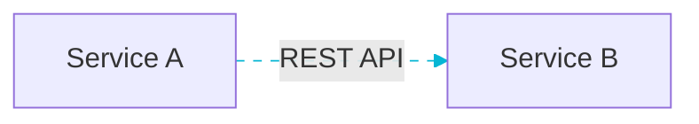

## Export Options

| Method | Command |
|--------|---------|
| **Live Editor** | https://mermaid.live |
| **CLI PNG** | `mmdc -i diagram.mmd -o output.png` |
| **CLI SVG** | `mmdc -i diagram.mmd -o output.svg` |
| **Custom Size** | `mmdc -i input.mmd -o output.png -w 1920 -H 1080` |
| **Dark BG** | `mmdc -i input.mmd -o output.svg -b "#111827"` |

## HTML Template

```html
<!DOCTYPE html>
<html lang="zh-CN">
<head>
  <meta charset="UTF-8">
  <meta name="viewport" content="width=device-width, initial-scale=1.0">
  <title>Mermaid Diagram</title>
  <style>
    body { margin: 0; background: #111827; }
    .mermaid { display: flex; justify-content: center; padding: 20px; }
    .mermaid svg { max-width: 100%; height: auto; }
  </style>
</head>
<body>
  <div class="mermaid">
flowchart LR
    A[Start] --> B[Process] --> C[End]
  </div>
  
  <script type="module">
    import mermaid from 'https://cdn.jsdelivr.net/npm/mermaid@10/dist/mermaid.esm.min.mjs';
    mermaid.initialize({
      startOnLoad: true,
      theme: 'dark',
      themeVariables: {
        primaryColor: '#3b82f6',
        background: '#111827',
        mainBkg: '#1e293b',
        fontSize: '14px'
      }
    });
  </script>
</body>
</html>
```

## Best Practices

1. **Start simple** — begin with core entities, add details incrementally
2. **Use meaningful names** — clear labels make diagrams self-documenting
3. **Comment extensively** — use `%%` comments to explain complex relationships
4. **Keep focused** — one diagram per concept; split large diagrams
5. **Version control** — store `.mmd` files alongside code
6. **Add context** — include titles and notes to explain purpose
7. **Iterate** — refine diagrams as understanding evolves

## Common Pitfalls

| Error | Cause | Solution |
|-------|-------|----------|
| `Nodes undefined` | Chinese class names | Use English identifiers |
| `No diagram type` | Syntax error | Validate in mermaid.live |
| Diagram too small | Missing config | Set `useMaxWidth: false` |
| `Mermaid not defined` | Load order | Use `waitForMermaid()` |
| Lines crossing | Complex layout | Use ELK layout |
| Truncated text | Too many nodes | Split into multiple diagrams |

## NEVER Do

1. **NEVER create diagrams with >15 nodes** — unreadable; split into focused views
2. **NEVER leave arrows unlabeled** — every connection should explain the relationship
3. **NEVER create diagrams without a title** — context-free diagrams are useless
4. **NEVER use diagrams as sole documentation** — pair with prose explaining the "why"
5. **NEVER let diagrams go stale** — update when architecture changes
6. **NEVER use Mermaid for data visualization** — it's for architecture, not charts

## Quick Reference

### Entity with Methods Template

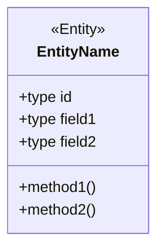

### Complete Relationship Set

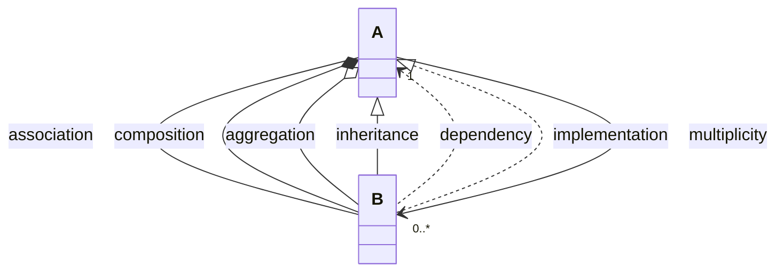

### Flowchart Complete Shapes

```mermaid
flowchart LR
    A[Rectangle] B([Pill]) C[[Subroutine]]
    D[(Cylinder)] E((Circle)) F{Decision}
    G{{Hexagon}} H[/IO/] I[/Trapezoid\]
```
