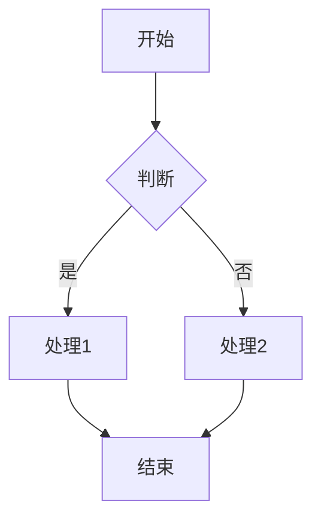
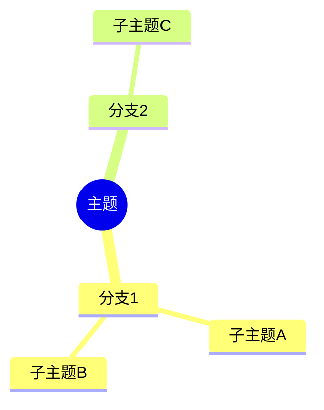
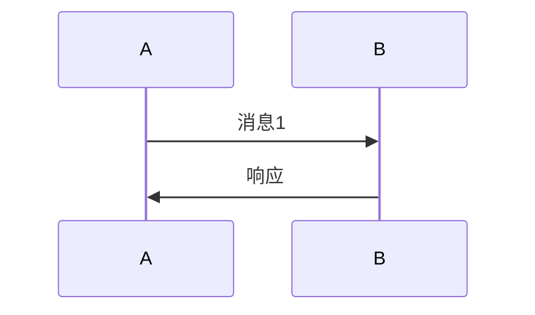

# Diagram Tools 图表工具技能

强大的图表生成工具集，支持多种图表格式和渲染引擎。

## 适用场景

- 📊 流程图设计
- 🧠 思维导图
- 📈 数据可视化
- 🔄 架构图
- 📑 UML 图
- 📅 时间线图

## 核心功能

### 1. Mermaid 图表
使用 Mermaid 语法生成各类图表：
- Flowchart 流程图
- Sequence 时序图
- Class 类图
- State 状态图
- ER 数据库图
- Gantt 甘特图
- Pie 饼图
- Mindmap 思维导图
- Timeline 时间线

### 2. Graphviz 图表
使用 DOT 语言生成：
- 有向图/无向图
- 层级图
- 树形图

### 3. 数据图表
- 柱状图
- 折线图
- 饼图

## Mermaid 语法示例

### 流程图


### 思维导图


### 时序图


## Graphviz 示例

```python
from graphviz import Digraph
dot = Digraph()
dot.node('A', '节点A')
dot.node('B', '节点B')
dot.edge('A', 'B')
dot.render('output', format='png')
```

## 支持的图表类型

| 类型 | Mermaid 语法 |
|------|-------------|
| 流程图 | `graph TD` / `graph LR` |
| 时序图 | `sequenceDiagram` |
| 类图 | `classDiagram` |
| 状态图 | `stateDiagram-v2` |
| ER图 | `erDiagram` |
| 甘特图 | `gantt` |
| 饼图 | `pie` |
| 思维导图 | `mindmap` |
| 时间线 | `timeline` |
| 四象限 | `quadrantChart` |

## 主题配置

自定义颜色主题：

```json
{
  "theme": "base",
  "themeVariables": {
    "primaryColor": "#1976d2",
    "lineColor": "#666666",
    "secondaryColor": "#4caf50"
  }
}
```

## 使用技巧

- 使用 `graph LR` 表示从左到右
- 使用 `graph TD` 表示从上到下
- 保持节点标签简短
- 使用子图分组相关组件
- 高清输出使用 `-s 2` 或 `-s 3`

## 相关技能

- `mermaid` - Mermaid 图表
- `markdown-tools` - Markdown 处理
- `meeting-notes` - Word 文档

## 更新日志

- v1.0.0 - 初始版本，整合 Mermaid 和 Graphviz
